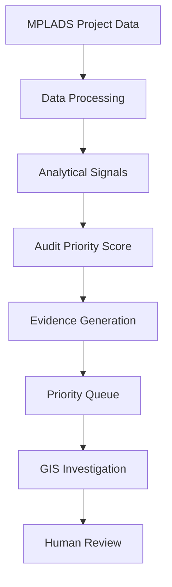

# MPLADS Sentinel

### Explainable AI/ML and GIS-Based Risk Intelligence for MPLADS

MPLADS Sentinel is an explainable analytical and AI/ML-assisted platform for analyzing MPLADS project data across **financial, timeline, geographic, agency, and progress-related dimensions**.

The system combines multiple analytical signals into a transparent **Audit Priority Score from 0–100**, helping authorized reviewers identify projects that may require closer examination.

> **Important:** Sentinel identifies patterns that deserve attention. It does not automatically declare fraud, corruption, or wrongdoing. Final findings and decisions remain with authorized human reviewers.

---

## Smart India Hackathon 2026

| Field             | Details                                                     |
| ----------------- | ----------------------------------------------------------- |
| Problem Statement | SIH26102                                                    |
| Ministry          | Ministry of Statistics and Programme Implementation (MoSPI) |
| Division          | Data Informatics and Innovation Division (DIID)             |
| Category          | Software                                                    |
| Theme             | Smart Automation                                            |
| Team              | Phantom Syndicate                                           |

---

## What Sentinel Does

MPLADS Sentinel evaluates projects using five complementary analytical signals:

### 1. Cost Anomaly — 30 Points

Identifies unusual project-cost patterns by comparing project values against relevant data distributions and expected ranges.

### 2. Timeline Anomaly — 25 Points

Highlights projects with unusual delays, extended completion periods, or timeline patterns that deserve review.

### 3. Duplicate / Spatial Similarity — 20 Points

Analyzes project descriptions and geographic information to identify potentially similar or closely located projects.

### 4. Agency Risk — 15 Points

Examines agency-level patterns across projects to identify unusual concentrations or recurring risk signals.

### 5. Progress / Expenditure Mismatch — 10 Points

Compares reported project progress with expenditure-related information to identify inconsistencies that may require verification.

---

## Audit Priority Score

The five signals are combined into a single transparent score:

| Signal                          | Maximum Score |
| ------------------------------- | ------------: |
| Cost Anomaly                    |            30 |
| Timeline Anomaly                |            25 |
| Duplicate / Spatial Similarity  |            20 |
| Agency Risk                     |            15 |
| Progress / Expenditure Mismatch |            10 |
| **Total**                       |       **100** |

The score represents **review priority**, not probability of fraud and not a final finding.

---

## Explainable Risk Intelligence

Instead of producing only a numerical score, Sentinel provides the evidence contributing to that score.

### Example

```text
Audit Priority Score: 78 / 100

Cost Anomaly:                  24 / 30
Timeline Anomaly:              20 / 25
Spatial Similarity:            15 / 20
Agency Risk:                   11 / 15
Progress/Expenditure Mismatch:  8 / 10

Priority: High
```

A reviewer can inspect the individual signals and supporting evidence instead of relying on an unexplained black-box prediction.

---

## System Architecture



### Architecture Flow

**Data → Processing → Analytical Signals → Priority Score → Evidence → Investigation → Human Review**

The architecture is designed to keep the analytical process transparent and allow reviewers to trace why a project received its priority score.

---

## GIS Intelligence

Sentinel incorporates geographic analysis to help reviewers investigate spatial patterns.

The GIS layer can help visualize:

* Project locations
* Geographical clusters
* Nearby or potentially similar projects
* Project concentration
* Spatial relationships between flagged projects

This allows analytical signals to be explored in a geographic context rather than only through tables and numerical scores.

---

## Technology Stack

### Frontend

* Next.js
* React
* TypeScript
* Tailwind CSS
* Recharts
* Leaflet / React Leaflet

### Backend

* Python
* FastAPI
* Pandas
* scikit-learn
* Pydantic

### Database

* PostgreSQL
* SQLAlchemy

### Analytical Components

* Statistical anomaly detection
* Similarity analysis
* Rule-based risk signals
* Machine-learning-assisted analysis
* Geographic analysis
* Explainable scoring

---

## Data Processing Pipeline

```text
MPLADS Data
     ↓
Data Cleaning & Validation
     ↓
Feature Preparation
     ↓
Analytical Signal Generation
     ↓
Signal Scoring
     ↓
Audit Priority Score
     ↓
Evidence Generation
     ↓
Dashboard / GIS
     ↓
Human Investigation
```

Each analytical signal contributes a defined maximum number of points, making the final score easier to understand and audit.

---

## Data and Validation

The system is designed to work with structured MPLADS project information such as:

* Project identifiers
* Project descriptions
* Project costs
* Sanction and completion dates
* Implementing agencies
* Project status
* Expenditure information
* Geographic coordinates
* Progress information

Where real-world data is unavailable or incomplete during development, **synthetic or validation data may be used to test analytical scenarios**.

Synthetic anomalies are validation scenarios and should not be interpreted as evidence of actual wrongdoing.

---

## Responsible Use

MPLADS Sentinel is designed as a **decision-support and investigation-prioritization system**.

It does not:

* Automatically declare fraud
* Accuse an agency or individual
* Treat an anomaly as proof of wrongdoing
* Replace authorized human investigation
* Guarantee that every flagged project contains an irregularity

Instead, it helps reviewers answer:

> **Which projects deserve closer attention, and what evidence contributed to that priority?**

Final verification and action remain the responsibility of authorized human reviewers.

---

## Project Structure

```text
mplads-sentinel/
│
├── frontend/
│   ├── app/
│   ├── components/
│   └── ...
│
├── backend/
│   ├── app/
│   ├── models/
│   ├── services/
│   └── ...
│
├── data/
├── docs/
├── README.md
└── ...
```

The exact project structure may evolve as development continues.

---

## Local Development

### Backend

From the project root:

```powershell
python -m venv .venv
.venv\Scripts\Activate.ps1
pip install -r backend\requirements.txt
python -m uvicorn backend.app.main:app --reload
```

Backend:

```text
http://localhost:8000
```

API documentation:

```text
http://localhost:8000/docs
```

### Frontend

Open a new terminal:

```powershell
cd frontend
npm install
npm run dev
```

Frontend:

```text
http://localhost:3000
```

> Run `npm install` inside the `frontend` directory where the frontend `package.json` is located.

---

## Team Phantom Syndicate

| Member                     | Role                                        |
| -------------------------- | ------------------------------------------- |
| **Nidhi**                  | Team Lead, Product Direction & Integration  |
| **Arati A. Patil**         | Documentation, Research & Presentation      |
| **Agam BharatKumar Doshi** | Research & Data Analysis                    |
| **Iffa A. Attar**          | Architecture, Domain & Solution Structuring |
| **Dayyanahmed Jamadar**    | Backend & ML                                |
| **Krupal Rayakar**         | Frontend & UI/UX                            |

---

## Project Status

**Smart India Hackathon 2026 — MVP Development**

MPLADS Sentinel is being developed as an explainable analytical platform for **risk prioritization, evidence-based investigation, and geographic project intelligence**.

---

## Key Idea

> **Detect patterns. Explain the evidence. Prioritize review. Keep humans in the loop.**
