# MPLADS Sentinel

## Explainable AI/ML and GIS-Based Risk Intelligence and Audit Prioritization for MPLADS

MPLADS Sentinel is an explainable AI/ML- and GIS-powered platform designed to analyze MPLADS project data, identify unusual patterns across financial, timeline, geographic, agency, and progress-related dimensions, and prioritize projects that may require further human investigation.

The platform combines multiple analytical risk signals into a transparent **Audit Priority Score from 0 to 100**, generates evidence explaining the factors contributing to that score, and presents prioritized projects through an interactive monitoring and investigation interface.

> **Sentinel identifies patterns that deserve attention. It does not automatically declare fraud or irregularity. Final findings remain with authorized human reviewers.**

---

# 1. Smart India Hackathon 2026

| Field             | Details                                                     |
| ----------------- | ----------------------------------------------------------- |
| Hackathon         | Smart India Hackathon 2026                                  |
| Problem Statement | SIH26102                                                    |
| Organization      | Ministry of Statistics and Programme Implementation (MoSPI) |
| Division          | Data Informatics & Innovation Division (DIID)               |
| Category          | Software                                                    |
| Theme             | Smart Automation                                            |
| Project           | MPLADS Sentinel                                             |
| Team              | Phantom Syndicate                                           |

---

# 2. Project Overview

MPLADS Sentinel is designed as a decision-support platform for monitoring projects implemented under the Members of Parliament Local Area Development Scheme (MPLADS).

The system brings together project, financial, geographical, implementation, agency, timeline, and progress-related information and processes it through multiple analytical layers.

Instead of requiring reviewers to examine every project with the same level of attention, Sentinel identifies combinations of unusual characteristics and converts them into an explainable prioritization mechanism.

The central workflow is:

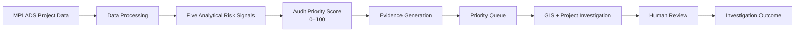

The platform is therefore designed around a simple principle:

**Detect patterns → Explain evidence → Prioritize attention → Support human investigation.**

---

# 3. Problem Statement

Large-scale implementation of MPLADS projects generates project information across multiple dimensions, including:

* project descriptions
* sanctioned amounts
* expenditure
* execution timelines
* project locations
* implementing agencies
* reported progress
* project status
* geographical relationships

When large numbers of project records must be reviewed, manually examining every project with equal depth can make it difficult to determine which projects should receive attention first.

Potential warning patterns may exist across different dimensions, such as:

* unusual project costs
* abnormal execution timelines
* potentially similar or spatially overlapping projects
* repeated unusual agency-level patterns
* mismatches between expenditure and reported progress

A single indicator may not provide sufficient context.

MPLADS Sentinel therefore uses a **multi-signal analytical approach** in which different types of evidence are evaluated independently and then combined into an explainable project-level priority score.

---

# 4. Proposed Solution

Sentinel follows an analytical-to-investigation workflow that connects raw project data with human review.

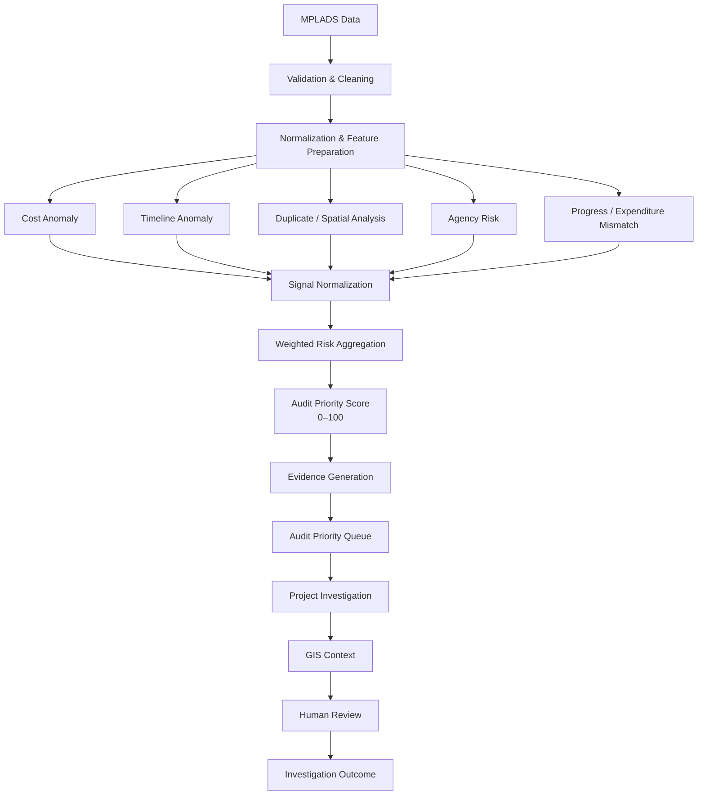

The system focuses on five primary stages:

1. **Analyze project data**
2. **Detect unusual patterns**
3. **Quantify analytical risk signals**
4. **Explain why a project was prioritized**
5. **Support structured human investigation**

---

# 5. Core Architecture

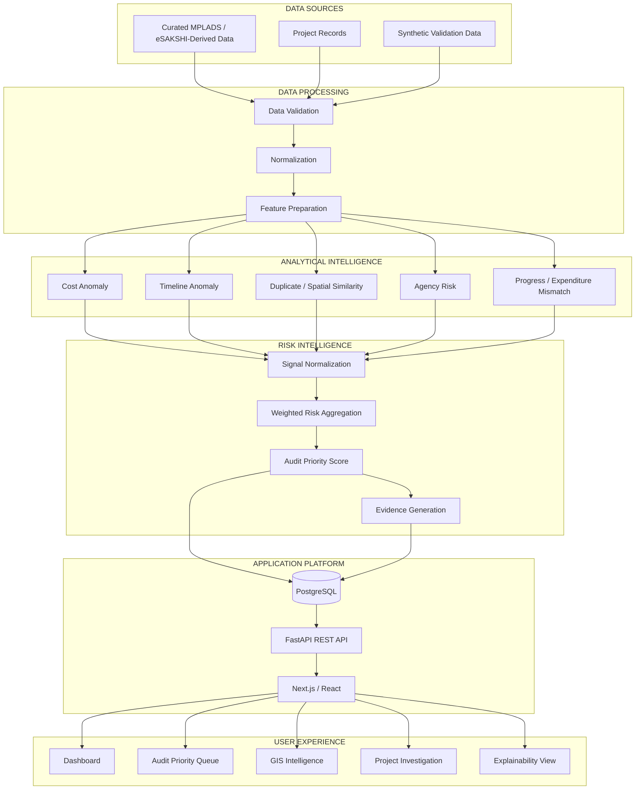

---

# 6. Five Analytical Risk Signals

Sentinel evaluates projects through five complementary analytical signals.

| Analytical Signal               | Maximum Contribution | Purpose                                                                  |
| ------------------------------- | -------------------: | ------------------------------------------------------------------------ |
| Cost Anomaly                    |                   30 | Identify unusual project cost patterns                                   |
| Timeline Anomaly                |                   25 | Identify unusual duration or delay patterns                              |
| Duplicate / Spatial Overlap     |                   20 | Identify potentially similar or geographically related projects          |
| Agency Risk                     |                   15 | Identify unusual historical agency-level patterns                        |
| Progress / Expenditure Mismatch |                   10 | Identify unusual relationships between expenditure and reported progress |
| **Total**                       |              **100** | **Composite Audit Priority Score**                                       |

These are referred to as **analytical risk signals** rather than five independent AI models because Sentinel combines multiple techniques, including machine learning, statistical analysis, rule-based comparisons, aggregation, geographic analysis, and similarity analysis.

---

# 7. Cost Anomaly Detection

## Objective

Identify projects whose cost appears unusual relative to relevant comparison groups.

Potential analytical techniques include:

* percentile comparison
* peer-project benchmarking
* statistical deviation
* Isolation Forest where applicable

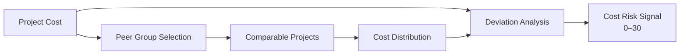

The resulting signal represents the relative cost anomaly within the selected comparison context.

### Example Evidence

```text
Observed Cost: ₹X
Peer Median: ₹Y
Deviation: +34%

Cost Signal: Elevated
Contribution: 22 / 30
```

The exact values depend on the dataset used during analysis and demonstration.

---

# 8. Timeline Anomaly Detection

## Objective

Identify projects whose execution duration differs significantly from relevant peer or benchmark patterns.

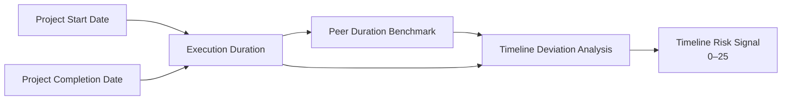

The system can compare project duration against relevant benchmark groups to identify unusual timeline behaviour.

The signal is intended to prioritize projects for review rather than determine the reason for the timeline deviation automatically.

---

# 9. Duplicate and Spatial Similarity Analysis

Potentially related projects can be identified through a combination of geographic proximity and project-description similarity.

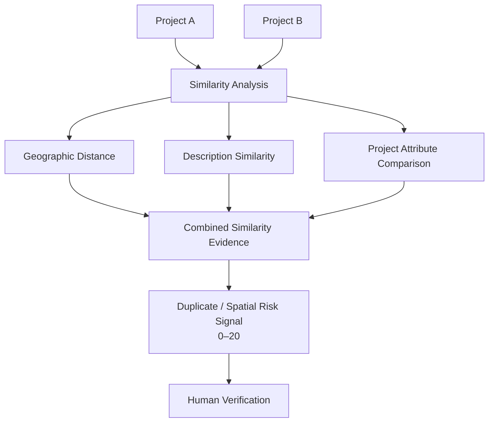

A similarity signal does **not** automatically establish duplication.

It creates a candidate relationship that can be examined by a reviewer.

---

# 10. Agency Risk Analysis

Project-level patterns may become more meaningful when analyzed in the context of historical implementing-agency behaviour.

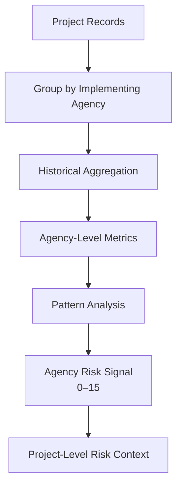

The signal provides historical analytical context for project investigation.

It does not treat an agency as inherently problematic.

---

# 11. Progress and Expenditure Mismatch

Sentinel compares reported financial expenditure with project progress to identify potentially unusual relationships.

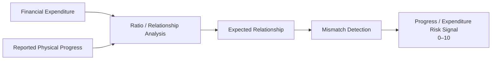

For example, a project showing substantially higher expenditure relative to reported physical progress may generate a review signal.

This signal does not establish wrongdoing by itself.

---

# 12. Audit Priority Score

The five analytical signals are combined into a transparent score ranging from 0 to 100.

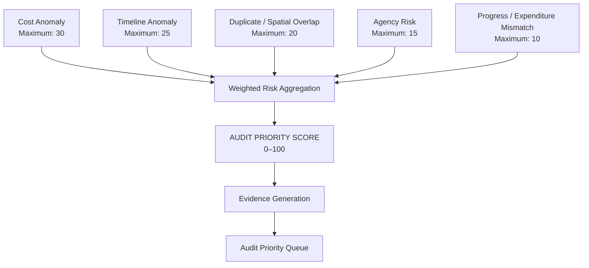

## Current MVP Weighting

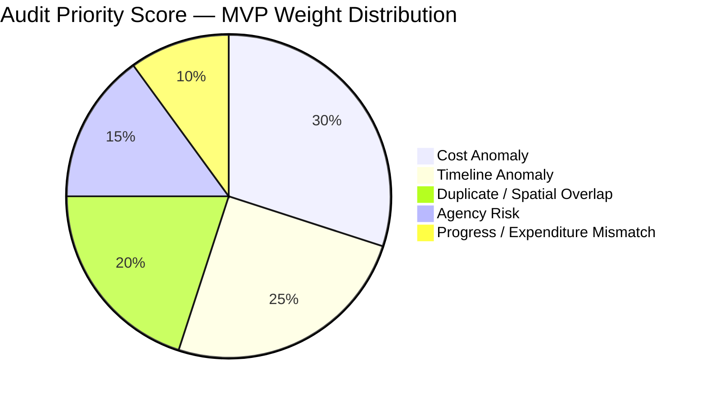

The current weights are **initial expert-defined MVP weights** intended to provide a transparent and controllable prioritization mechanism.

They are not presented as universally optimal statistical weights.

---

# 13. Score Calculation

Conceptually:

```text
Audit Priority Score
=
Cost Contribution
+
Timeline Contribution
+
Spatial / Duplicate Contribution
+
Agency Contribution
+
Progress / Expenditure Contribution
```

with:

```text
Cost Contribution                  ≤ 30
Timeline Contribution              ≤ 25
Spatial / Duplicate Contribution   ≤ 20
Agency Contribution                ≤ 15
Progress Contribution              ≤ 10

Total                               ≤ 100
```

The score is a **prioritization mechanism**, not a probability of fraud.

---

# 14. Explainability Layer

A risk score without evidence provides limited value.

Sentinel therefore follows:

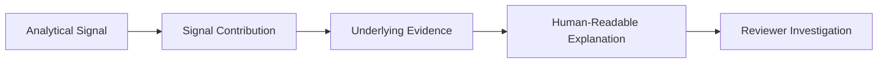

Instead of presenting only:

```text
Audit Priority Score: 87
```

the platform is designed to show the signals contributing to that score.

For example:

```text
Audit Priority Score: 87 / 100

Cost Anomaly: 26 / 30
Timeline Anomaly: 22 / 25
Spatial Similarity: 18 / 20
Agency Risk: 9 / 15
Progress Mismatch: 8 / 10
```

The reviewer can then inspect the supporting evidence for each signal.

---

# 15. Explainability Flow

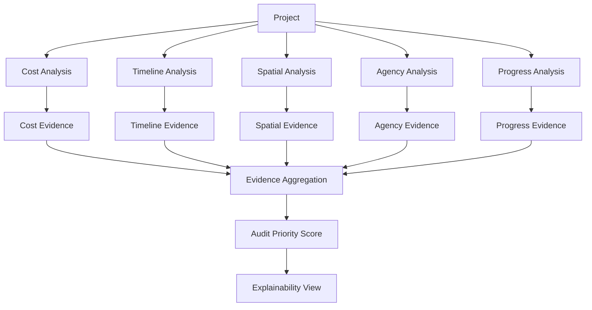

The objective is to maintain a traceable relationship between:

```text
Project Data
    ↓
Analytical Signal
    ↓
Score Contribution
    ↓
Supporting Evidence
    ↓
Human Investigation
```

---

# 16. Human-in-the-Loop Investigation

Sentinel intentionally keeps a human decision point between automated analysis and final action.

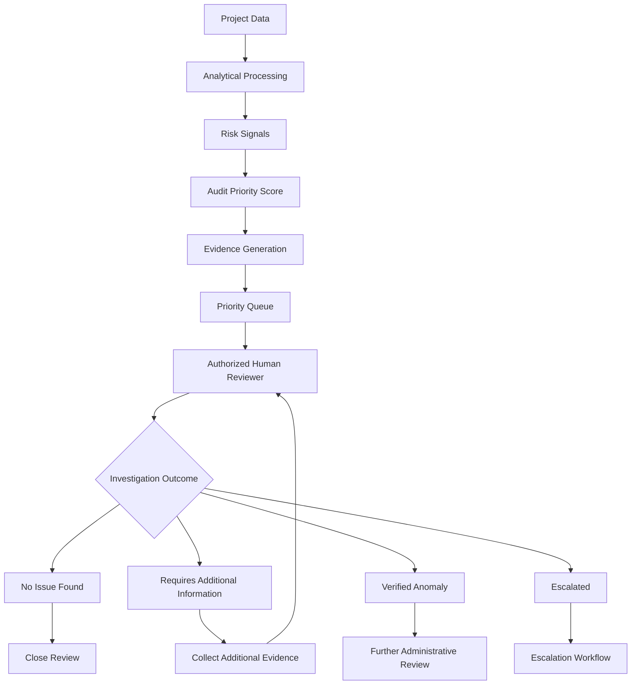

Possible investigation outcomes include:

* Under Review
* No Issue Found
* Requires Additional Information
* Verified Anomaly
* Escalated

These outcomes represent stages or results of human review.

A verified anomaly is not automatically equivalent to fraud.

---

# 17. Investigation Lifecycle

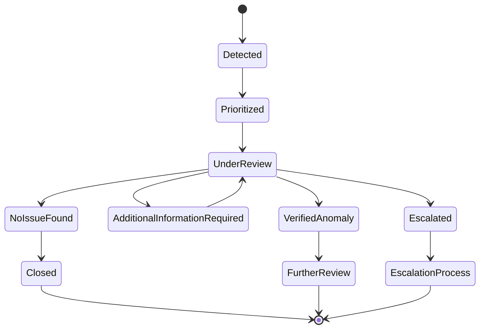

This workflow explicitly separates:

**automated analytical detection**

from

**human interpretation and investigation.**

---

# 18. GIS Intelligence

The GIS layer provides geographic context for project analysis.

It can support visualization of:

* project distribution
* project status
* expenditure patterns
* high-priority projects
* geographic clusters
* potentially related projects
* spatial relationships

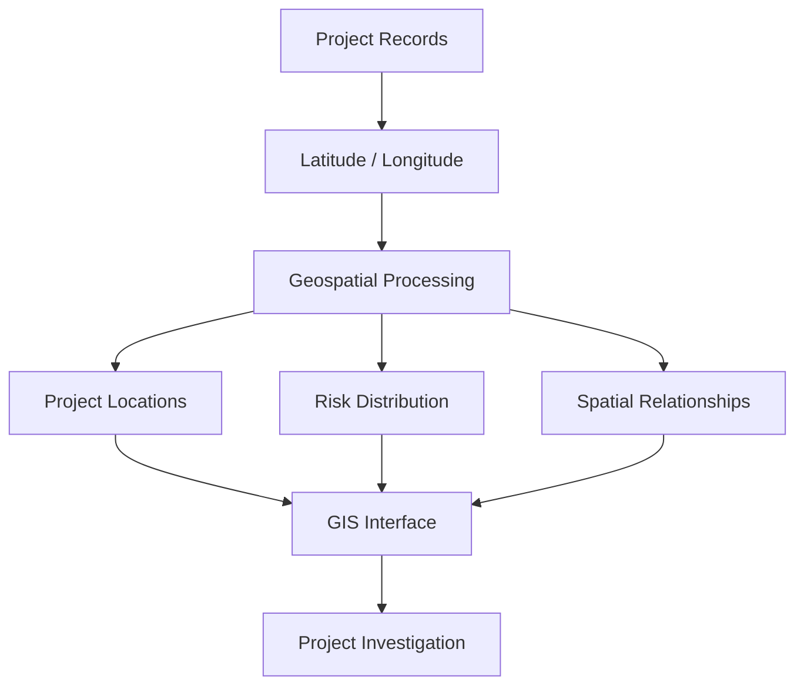

GIS is therefore part of the investigation workflow rather than simply a visualization layer.

---

# 19. Complete End-to-End Data Flow

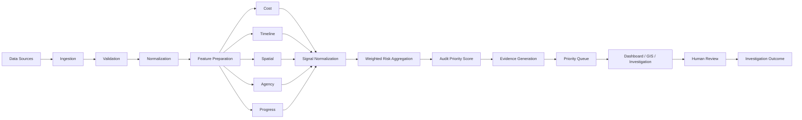

---

# 20. Full System Architecture

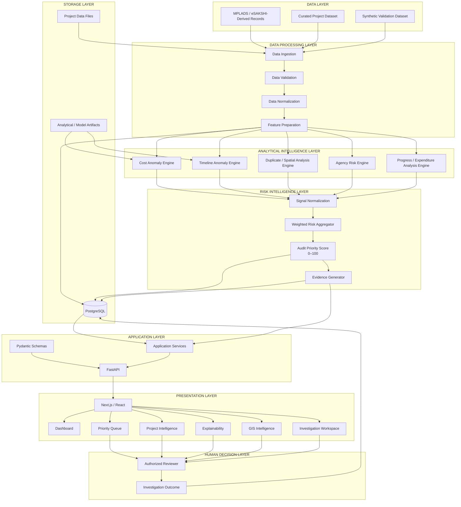

---

# 21. Architecture by Responsibility

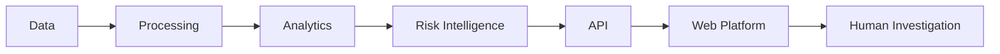

| Layer               | Responsibility                                      |
| ------------------- | --------------------------------------------------- |
| Data                | Store project and validation data                   |
| Processing          | Validate, normalize and prepare analytical features |
| Analytics           | Calculate five risk signals                         |
| Risk Intelligence   | Aggregate signals and generate evidence             |
| API                 | Expose analytical results to the frontend           |
| Web Platform        | Visualize, filter and investigate projects          |
| Human Investigation | Review evidence and record outcomes                 |

---

# 22. Technology Stack

## Frontend

* Next.js
* React
* TypeScript / TSX
* Tailwind CSS
* Recharts
* Leaflet
* React Leaflet
* Lucide React

## Backend

* Python
* FastAPI
* Pandas
* scikit-learn
* joblib
* Pydantic

## Database

* PostgreSQL
* SQLAlchemy

## Communication

REST / JSON APIs are used to connect the frontend with the backend.

```mermaid
flowchart LR

    FRONT["Next.js / React"]
    -->|"REST / JSON"|
    API["FastAPI"]

    API --> SERVICES["Application Services"]

    SERVICES --> DB[("PostgreSQL")]

    SERVICES --> ML["Analytical Components"]
```

---

# 23. Running Locally

MPLADS Sentinel consists of a Next.js frontend, FastAPI backend, analytical processing components, and PostgreSQL database.

The project can be developed locally with each layer running as an independent service.

## Prerequisites

| Requirement | Recommended Version   |
| ----------- | --------------------- |
| Node.js     | 20+                   |
| npm         | 10+                   |
| Python      | 3.11                  |
| PostgreSQL  | 14+                   |
| Git         | Latest stable version |

Python 3.11 is recommended for compatibility with the machine-learning and data-processing dependencies.

---

## 23.1 Clone the Repository

```powershell
git clone https://github.com/the-nidhi-bhat/mplads-sentinel.git
cd mplads-sentinel
```

---

## 23.2 Configure Environment Variables

If an environment template is provided:

```powershell
Copy-Item .env.example .env
```

Configure the required local values in `.env`.

Do not commit credentials, API keys, passwords, or other secrets.

---

## 23.3 Set Up the Backend

Create a Python virtual environment:

```powershell
cd backend

python -m venv .venv
```

Activate it on Windows PowerShell:

```powershell
.\.venv\Scripts\Activate.ps1
```

Install dependencies:

```powershell
pip install -r requirements.txt
```

Return to the repository root:

```powershell
cd ..
```

---

## 23.4 Configure PostgreSQL

Ensure PostgreSQL is running locally.

Create the database required by the application and configure the connection string expected by the backend.

For example:

```text
DATABASE_URL=postgresql://<username>:<password>@localhost:5432/<database_name>
```

Use the actual local credentials and database name.

---

## 23.5 Start the Backend

Start FastAPI from the repository root.

```powershell
python -m uvicorn backend.app.main:app --reload --port 8000
```

If the implemented backend entry point differs from the command above, use the entry point defined by the current repository structure.

Once running:

```text
Backend:
http://localhost:8000

API Documentation:
http://localhost:8000/docs

OpenAPI Schema:
http://localhost:8000/openapi.json
```

---

## 23.6 Start the Frontend

Open a second terminal:

```powershell
cd frontend
```

Install dependencies:

```powershell
npm install
```

Start the development server:

```powershell
npm run dev
```

The frontend will normally be available at:

```text
http://localhost:3000
```

---

## 23.7 Local Development Architecture

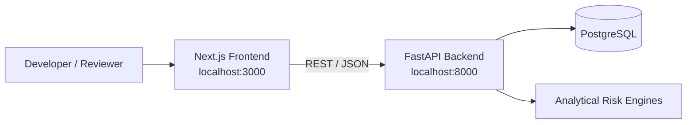

---

## 23.8 Development Workflow

### Terminal 1 — Backend

```powershell
cd <repository-root>

.\backend\.venv\Scripts\Activate.ps1

python -m uvicorn backend.app.main:app --reload --port 8000
```

### Terminal 2 — Frontend

```powershell
cd <repository-root>\frontend

npm run dev
```

### Terminal 3 — Database

Keep PostgreSQL running.

---

## 23.9 Verify the Backend

Open:

```text
http://localhost:8000/docs
```

Verify that:

* the API starts without import errors
* database connectivity is available
* required endpoints are registered
* project data can be retrieved
* analytical endpoints respond correctly

---

## 23.10 Verify the Frontend

Open:

```text
http://localhost:3000
```

Verify that:

* the dashboard loads
* project data is displayed
* the priority queue is accessible
* project details can be opened
* risk signals and score information are displayed
* GIS views load correctly
* the investigation interface is accessible

---

## 23.11 Docker Development

Docker Compose configuration is included for environments where the project services are containerized.

From the repository root:

```powershell
docker compose up --build
```

To stop the services:

```powershell
docker compose down
```

The native Node.js/Python/PostgreSQL setup remains useful for direct development and debugging.

---

# 24. API and Application Flow

The application follows a REST-based communication model.

```mermaid
sequenceDiagram

    actor User

    participant Frontend as Next.js / React
    participant API as FastAPI
    participant Analytics as Risk Engines
    participant DB as PostgreSQL

    User->>Frontend: Open project / dashboard

    Frontend->>API: Request project data

    API->>DB: Query project records

    DB-->>API: Project data

    API-->>Frontend: Project response

    User->>Frontend: Request risk analysis

    Frontend->>API: Request analytical result

    API->>Analytics: Run / retrieve risk analysis

    Analytics->>DB: Read required data

    DB-->>Analytics: Project features

    Analytics-->>API: Signals + score + evidence

    API-->>Frontend: Analytical response

    Frontend-->>User: Display score, evidence and GIS context
```

The API layer acts as the boundary between the presentation layer, database, and analytical components.

---

# 25. Repository Structure

```text
mplads-sentinel/
│
├── frontend/
│   ├── app/
│   ├── components/
│   ├── lib/
│   ├── styles/
│   ├── public/
│   ├── package.json
│   └── tsconfig.json
│
├── backend/
│   ├── app/
│   │   ├── api/
│   │   ├── models/
│   │   ├── schemas/
│   │   ├── ml/
│   │   ├── data_pipeline/
│   │   ├── main.py
│   │   └── database.py
│   │
│   ├── model_artifacts/
│   ├── data/
│   └── requirements.txt
│
├── docs/
│   └── MASTER_ARCHITECTURE.md
│
├── docker-compose.yml
├── .env.example
├── .gitignore
└── README.md
```

---

# 26. Data Architecture

```mermaid
erDiagram

    PROJECT {
        string project_id PK
        string project_name
        string category
        string district
        string constituency
        string agency_id
        float sanctioned_amount
        float expenditure
        float progress
        date start_date
        date completion_date
        float latitude
        float longitude
    }

    AGENCY {
        string agency_id PK
        string agency_name
        string agency_type
    }

    RISK_ANALYSIS {
        string analysis_id PK
        string project_id FK
        float cost_score
        float timeline_score
        float spatial_score
        float agency_score
        float progress_score
        float total_score
    }

    EVIDENCE {
        string evidence_id PK
        string project_id FK
        string signal_type
        string evidence_text
        float observed_value
        float benchmark_value
    }

    INVESTIGATION {
        string investigation_id PK
        string project_id FK
        string status
        string finding
        string reviewer_note
    }

    AGENCY ||--o{ PROJECT : implements

    PROJECT ||--o| RISK_ANALYSIS : receives

    PROJECT ||--o{ EVIDENCE : generates

    PROJECT ||--o{ INVESTIGATION : undergoes
```

---

# 27. Dashboard Architecture

```mermaid
flowchart TB

    DASH["Sentinel Dashboard"]

    DASH --> OVERVIEW["Overview"]

    DASH --> PRIORITY["Audit Priority Queue"]

    DASH --> GIS["GIS Intelligence"]

    DASH --> SEARCH["Project Search"]

    DASH --> INVEST["Investigation Workspace"]

    OVERVIEW --> O1["Projects Monitored"]
    OVERVIEW --> O2["High-Priority Projects"]
    OVERVIEW --> O3["Risk Distribution"]
    OVERVIEW --> O4["Signal Distribution"]

    PRIORITY --> P1["Audit Priority Score"]
    PRIORITY --> P2["Project Status"]
    PRIORITY --> P3["Location"]
    PRIORITY --> P4["Risk Signals"]

    GIS --> G1["Project Locations"]
    GIS --> G2["Risk Distribution"]
    GIS --> G3["Spatial Relationships"]

    INVEST --> I1["Score Breakdown"]
    INVEST --> I2["Evidence"]
    INVEST --> I3["GIS Context"]
    INVEST --> I4["Investigation Status"]
    INVEST --> I5["Reviewer Outcome"]
```

---

# 28. Validation Strategy

Sentinel uses controlled synthetic scenarios to test analytical behaviour.

```mermaid
flowchart LR

    A["Baseline Dataset"]
    --> B["Controlled Anomaly Injection"]

    B --> C["Known Synthetic Scenario"]

    C --> D["Run Sentinel"]

    D --> E["Generated Risk Signals"]

    E --> F["Compare Against Expected Pattern"]

    F --> G["Validation Result"]
```

Potential validation scenarios include:

* unusual project cost
* unusual execution duration
* potentially similar projects
* agency-level patterns
* expenditure/progress mismatch

Synthetic scenarios are explicitly labelled as synthetic and are not presented as real government findings.

---

# 29. Data Honesty

Sentinel clearly distinguishes between source information and controlled demonstration data.

```mermaid
flowchart TB

    A["Project Data"]

    A --> B["Curated / Derived Data"]
    A --> C["Synthetic Validation Data"]
    A --> D["Analytical Features"]

    B --> E["Monitoring & Analysis"]
    C --> F["Controlled Validation"]
    D --> G["Risk Signals"]
```

Synthetic anomalies are used only for controlled validation and demonstration.

They are not presented as actual government irregularities.

Similarly, a high Audit Priority Score is not represented as proof of fraud.

The current MVP does not claim live integration with government systems unless such integration is explicitly implemented.

---

# 30. Responsible AI Design

Sentinel follows five core principles.

## Explainability

Important analytical results should be connected to measurable evidence.

## Human Decision-Making

Automated analysis prioritizes projects for attention; authorized humans determine findings.

## Data Honesty

Synthetic, curated, and derived information are clearly distinguished.

## Reproducibility

Analytical methods, dependencies, data assumptions, and validation scenarios should be documented.

## MVP Discipline

The system prioritizes a coherent working architecture over unnecessary infrastructure or unsupported features.

---

# 31. MVP Architecture Philosophy

The MVP intentionally uses a lightweight architecture.

```mermaid
flowchart LR

    FRONT["Next.js"]
    --> API["FastAPI"]

    API --> ANALYTICS["Python Analytical Components"]

    API --> DB[("PostgreSQL")]
```

The initial architecture does not make distributed infrastructure a prerequisite for the core demonstration.

Components such as:

* Kafka
* Kubernetes
* Celery
* Redis
* S3 / MinIO
* mandatory PostGIS infrastructure

are not required unless the implemented workload actually justifies them.

This keeps the MVP easier to:

* run
* test
* debug
* explain
* demonstrate
* reproduce

---

# 32. Scalability Path

```mermaid
flowchart LR

    A["MVP"]
    --> B["Production Data Pipelines"]

    B --> C["Background Processing"]

    C --> D["Advanced Geospatial Infrastructure"]

    D --> E["Distributed Analytics"]

    E --> F["Large-Scale Deployment"]
```

Potential future extensions include:

* advanced semantic similarity
* richer geospatial analysis
* additional analytical signals
* document intelligence
* evidence ingestion
* reviewer feedback loops
* model monitoring
* asynchronous processing
* production-grade object storage
* advanced access control

These are future extensions rather than current MVP claims.

---

# 33. SIH Demonstration Flow

The recommended demonstration follows one project through the complete Sentinel workflow.

```mermaid
sequenceDiagram

    actor Reviewer

    participant UI as Sentinel UI
    participant API as FastAPI
    participant Risk as Risk Engine
    participant DB as PostgreSQL

    Reviewer->>UI: Open Dashboard

    UI->>API: Request project overview

    API->>DB: Retrieve project data

    DB-->>API: Project records

    API-->>UI: Dashboard data

    Reviewer->>UI: Open Priority Queue

    UI->>API: Request prioritized projects

    API->>Risk: Calculate / retrieve risk signals

    Risk->>DB: Retrieve analytical data

    DB-->>Risk: Project features

    Risk-->>API: Risk signals + score + evidence

    API-->>UI: Priority queue

    Reviewer->>UI: Select project

    UI->>API: Request investigation details

    API-->>UI: Score + evidence + GIS context

    Reviewer->>UI: Review evidence

    Reviewer->>UI: Record investigation outcome

    UI->>API: Submit outcome

    API->>DB: Store investigation result

    DB-->>API: Confirmation

    API-->>UI: Updated investigation status
```

---

# 34. Recommended SIH Demo Story

The demonstration should communicate one continuous investigation journey.

```mermaid
flowchart LR

    A["Sentinel receives project data"]
    --> B["Five analytical signals evaluate the project"]

    B --> C["Project receives Audit Priority Score"]

    C --> D["System explains why"]

    D --> E["Project enters Priority Queue"]

    E --> F["Reviewer opens project"]

    F --> G["GIS provides geographic context"]

    G --> H["Reviewer investigates"]

    H --> I["Reviewer records outcome"]
```

The objective is to demonstrate a complete workflow rather than a collection of disconnected screens.

---

# 35. Team — Phantom Syndicate

MPLADS Sentinel is developed by **Team Phantom Syndicate** for Smart India Hackathon 2026.

| Team Member                | Primary Responsibility                                                                                                                |
| -------------------------- | ------------------------------------------------------------------------------------------------------------------------------------- |
| **Nidhi — Team Lead**      | Product direction, system coordination, architecture oversight, integration, technical decision-making and overall project leadership |
| **Arati A. Patil**         | Documentation, research support and presentation development                                                                          |
| **Agam BharatKumar Doshi** | Research, data analysis and domain/data support                                                                                       |
| **Iffa A. Attar**          | System architecture, domain design and solution structuring                                                                           |
| **Dayyanahmed Jamadar**    | Backend and machine-learning development                                                                                              |
| **Krupal Rayakar**         | Frontend development and UI/UX implementation                                                                                         |

---

# 36. Team-to-System Mapping

```mermaid
flowchart TB

    N["Nidhi<br/>Team Lead"]

    A["Arati A. Patil<br/>Documentation & Presentation"]

    G["Agam BharatKumar Doshi<br/>Research & Data"]

    I["Iffa A. Attar<br/>Architecture & Domain Design"]

    D["Dayyanahmed Jamadar<br/>Backend & ML"]

    K["Krupal Rayakar<br/>Frontend & UI/UX"]

    N --> I
    N --> D
    N --> K
    N --> G
    N --> A

    I --> ARCH["System Architecture"]

    G --> DATA["Research & Data Layer"]

    D --> ML["Analytical Intelligence"]

    K --> UI["Web Platform"]

    A --> DOCS["Documentation & Presentation"]

    ARCH --> INT["Integrated Sentinel Platform"]
    DATA --> INT
    ML --> INT
    UI --> INT
    DOCS --> INT

    INT --> N
```

---

# 37. Team Operating Model

```mermaid
flowchart LR

    A["Research"]
    --> B["Domain Understanding"]

    B --> C["Architecture"]

    C --> D["Backend & Analytics"]

    D --> E["Frontend Integration"]

    E --> F["Testing & Validation"]

    F --> G["Documentation & Presentation"]

    G --> H["SIH Demonstration"]
```

The team structure maps research, domain understanding, architecture, analytical development, interface development, validation, and presentation into one coordinated project lifecycle.

---

# 38. Why Sentinel

The central challenge is not simply detecting an unusual value.

The more important challenge is connecting:

```mermaid
flowchart LR

    A["Detection"]
    --> B["Measurement"]

    B --> C["Explanation"]

    C --> D["Prioritization"]

    D --> E["Investigation"]

    E --> F["Human Finding"]
```

Sentinel therefore treats anomaly analysis as the beginning of an investigation workflow rather than the final decision.

---

# 39. Key Design Principles

```mermaid
mindmap
  root((MPLADS Sentinel))
    Explainability
      Evidence
      Transparent scoring
      Signal-level breakdown
    Human Decision Making
      Human review
      Investigation outcomes
      No automatic fraud declaration
    Multi-Signal Analysis
      Cost
      Timeline
      Spatial
      Agency
      Progress
    GIS Intelligence
      Project distribution
      Spatial relationships
      Geographic context
    Data Honesty
      Curated data
      Synthetic validation
      Clear limitations
    Reproducibility
      Version control
      Documented methods
      Validation scenarios
    MVP Discipline
      Lightweight infrastructure
      Modular design
      Incremental implementation
```

---

# 40. Project Status

**Smart India Hackathon 2026 — MVP Development**

The project is being developed incrementally around SIH Problem Statement **SIH26102**.

Current development priorities are:

1. Analytical correctness
2. Explainability
3. Reproducibility
4. Evidence-backed prioritization
5. Human-in-the-loop investigation
6. Modular architecture
7. Focused MVP scope

The implementation is intentionally incremental so that each analytical component can be validated before being integrated into the complete investigation workflow.

---

# 41. Final Architecture

The complete Sentinel concept can be summarized as:

```mermaid
flowchart TB

    DATA["MPLADS PROJECT DATA"]

    DATA --> PROCESS["DATA PROCESSING"]

    PROCESS --> SIGNALS["FIVE ANALYTICAL RISK SIGNALS"]

    SIGNALS --> SCORE["AUDIT PRIORITY SCORE<br/>0–100"]

    SCORE --> EVIDENCE["EVIDENCE GENERATION"]

    EVIDENCE --> QUEUE["AUDIT PRIORITY QUEUE"]

    QUEUE --> GIS["GIS CONTEXT"]

    QUEUE --> INVEST["PROJECT INVESTIGATION"]

    GIS --> INVEST

    INVEST --> HUMAN["AUTHORIZED HUMAN REVIEW"]

    HUMAN --> OUTCOME["INVESTIGATION OUTCOME"]

    OUTCOME --> CLOSED["CLOSED / ADDITIONAL INFORMATION / VERIFIED ANOMALY / ESCALATED"]
```

---

# 42. Sentinel in One Sentence

**MPLADS Sentinel transforms project-level MPLADS data into an explainable, evidence-backed audit-priority workflow that helps human reviewers identify where closer investigation may be warranted.**

---

# 43. The Sentinel Principle

```mermaid
flowchart LR

    A["AI / Analytics<br/>Detects Patterns"]
    --> B["Evidence<br/>Explains Them"]

    B --> C["Sentinel<br/>Prioritizes Them"]

    C --> D["Human Reviewer<br/>Investigates Them"]

    D --> E["Authorized Decision<br/>Determines the Outcome"]
```

**Detect patterns. Explain evidence. Prioritize attention. Support human investigation.**
