# 🛡️ MPLADS Sentinel

### Explainable AI-Powered Risk Intelligence & Audit Prioritization for MPLADS

> **From thousands of project records to a focused, evidence-backed investigation queue.**

[](https://www.sih.gov.in/)
[](#-smart-india-hackathon-problem-statement)
[](#-smart-india-hackathon-problem-statement)
[](#-smart-india-hackathon-problem-statement)
[](#-project-status)

---

## 🎯 Smart India Hackathon 2026

| Field                 | Details                                                                                                           |
| --------------------- | ----------------------------------------------------------------------------------------------------------------- |
| **Hackathon**         | Smart India Hackathon 2026                                                                                        |
| **Problem Statement** | **SIH26102**                                                                                                      |
| **Problem Title**     | Development of an AI-powered system to detect anomalies, fraud, and inefficiencies in MPLAD Scheme implementation |
| **Organization**      | Ministry of Statistics and Programme Implementation (MoSPI)                                                       |
| **Division**          | Data Informatics & Innovation Division (DIID)                                                                     |
| **Category**          | Software                                                                                                          |
| **Theme**             | Smart Automation                                                                                                  |
| **Project**           | **MPLADS Sentinel**                                                                                               |
| **Team**              | **Phantom Syndicate**                                                                                             |

---

# 🧭 1. What is MPLADS Sentinel?

**MPLADS Sentinel** is an explainable AI/ML- and GIS-powered **project monitoring, anomaly analysis, and audit-prioritization platform** designed for the monitoring of projects under the Members of Parliament Local Area Development Scheme (MPLADS).

Instead of requiring authorities to manually inspect every project with equal priority, Sentinel analyzes project-level information across multiple dimensions and identifies **unusual patterns that deserve closer human attention**.

The platform combines:

* financial anomaly analysis
* timeline and delay analysis
* duplicate/spatial similarity detection
* agency-level risk analysis
* progress-versus-expenditure analysis
* explainable scoring
* evidence generation
* GIS-based exploration
* investigation workflow
* human-in-the-loop decision making

### The core idea

```text
                 MPLADS PROJECT DATA
                         │
                         ▼
                ┌─────────────────┐
                │ Data Processing │
                │ & Normalization │
                └────────┬────────┘
                         │
                         ▼
              ┌──────────────────────┐
              │ 5 Risk Signal Engine │
              └──────────┬───────────┘
                         │
        ┌────────────────┼────────────────┐
        ▼                ▼                ▼
     Financial        Timeline        Duplicate /
     Anomaly          Anomaly         Spatial
        │                │             Similarity
        └────────────────┼────────────────┘
                         │
                ┌────────┴────────┐
                │ Risk Aggregator │
                └────────┬────────┘
                         │
                         ▼
                AUDIT PRIORITY SCORE
                       0 — 100
                         │
                         ▼
                Evidence Generation
                         │
                         ▼
                PRIORITY QUEUE
                         │
             ┌───────────┴───────────┐
             ▼                       ▼
        GIS Exploration       Project Investigation
             │                       │
             └───────────┬───────────┘
                         ▼
                 HUMAN REVIEWER
                         │
                         ▼
              Finding / Escalation
```

> **Sentinel does not declare fraud automatically.**
>
> It identifies patterns that deserve attention, explains the evidence behind those patterns, and helps authorized human reviewers decide what requires further investigation.

---

# 🚨 2. The Problem

MPLADS involves a large and diverse set of development works distributed across constituencies, districts, implementing agencies, project categories, financial records and execution timelines.

At this scale, conventional monitoring can face a fundamental challenge:

> **The difficult question is not only “What happened?” — it is “Which projects should be examined first, and why?”**

Potential warning patterns may be distributed across different dimensions of a project.

For example:

* a project may have an unusual cost compared with similar works
* a project may remain incomplete beyond expected timelines
* two projects may have highly similar descriptions or nearby locations
* an implementing agency may repeatedly appear in unusual patterns
* expenditure may be disproportionately high compared with reported physical progress

Looking at any one signal independently can produce incomplete conclusions.

### Sentinel therefore uses a multi-signal approach.

```text
             SINGLE SIGNAL
                  │
                  ▼
        "Something looks unusual"
                  │
                  ▼
          Limited context

                    VS

              MULTI-SIGNAL
                  │
       ┌──────────┼──────────┐
       ▼          ▼          ▼
      Cost      Timeline    Spatial
       │          │          │
       └──────────┼──────────┘
                  ▼
          Combined evidence
                  │
                  ▼
       Audit-priority decision
```

---

# 💡 3. Proposed Solution

MPLADS Sentinel introduces a **risk-based monitoring layer** over MPLADS project data.

Instead of attempting to automatically determine whether an irregularity is fraudulent, Sentinel follows a safer and more useful workflow:

```text
DETECT
  ↓
MEASURE
  ↓
EXPLAIN
  ↓
PRIORITIZE
  ↓
INVESTIGATE
  ↓
HUMAN DECISION
```

The system converts multiple analytical signals into an **Audit Priority Score (0–100)**.

A higher score means:

> **“This project contains more signals that may justify closer examination.”**

It does **not** mean:

> “This project is proven fraudulent.”

---

# 🧠 4. Sentinel's Core Intelligence Model

Sentinel uses five complementary analytical risk signals.

| #  | Risk Signal                        | Maximum Contribution | Primary Purpose                                      |
| -- | ---------------------------------- | -------------------: | ---------------------------------------------------- |
| 01 | 💰 Cost Anomaly                    |                   30 | Detect unusual project cost patterns                 |
| 02 | ⏱️ Timeline Anomaly                |                   25 | Identify unusual execution duration/delay            |
| 03 | 📍 Duplicate / Spatial Overlap     |                   20 | Identify potentially similar or overlapping works    |
| 04 | 🏢 Agency Risk                     |                   15 | Detect unusual agency-level historical patterns      |
| 05 | 📈 Progress / Expenditure Mismatch |                   10 | Compare financial expenditure with physical progress |
|    | **Total**                          |              **100** | **Composite Audit Priority Score**                   |

These are intentionally treated as **analytical risk signals**, not five unrelated “AI models.”

---

# 💰 5. Signal 01 — Cost Anomaly

### Objective

Identify projects whose cost appears unusual relative to relevant comparison groups.

### Analytical approach

The system can combine:

* statistical outlier analysis
* percentile comparison
* peer/project-category benchmarking
* Isolation Forest where applicable

### Concept

```text
Project Cost
     │
     ▼
Compare against relevant peers
     │
     ├── Project category
     ├── Location
     ├── Scale
     └── Comparable works
     │
     ▼
Deviation Analysis
     │
     ▼
Cost Risk Signal
     │
     ▼
Maximum Contribution: 30
```

### Example evidence

```text
Observed Cost:        ₹X
Peer Median:          ₹Y
Deviation:            +34%

Cost Signal:          Elevated
Contribution:         22 / 30
```

The actual numerical evidence is retained so that the score can be explained rather than presented as a black-box number.

---

# ⏱️ 6. Signal 02 — Timeline Anomaly

### Objective

Identify projects whose execution timeline differs significantly from comparable projects or expected benchmarks.

### Analysis

Sentinel considers relevant timeline information and compares execution behaviour against peer patterns.

```text
Start Date
    │
    ▼
Expected / Peer Duration
    │
    ├───────────────┐
    │               │
    ▼               ▼
Actual Duration   Progress
    │               │
    └───────┬───────┘
            ▼
      Timeline Analysis
            │
            ▼
      Timeline Signal
```

### Example

```text
Peer Benchmark:      10 months
Observed Duration:   18 months
Deviation:           1.8× benchmark

Timeline Signal:     Elevated
```

---

# 📍 7. Signal 03 — Duplicate / Spatial Overlap

Potentially similar projects can be difficult to identify when information is distributed across records.

Sentinel can combine:

* geographic proximity
* project-description similarity
* relevant project attributes

to identify **candidate relationships requiring review**.

### Concept

```text
Project A
   │
   ├── Description similarity
   ├── Geographic distance
   ├── Cost similarity
   └── Project attributes
             │
             ▼
      Similarity Analysis
             │
             ▼
      Candidate Match
             │
             ▼
       Human Review
```

### Important principle

A similar project is **not automatically a duplicate**.

Similarity creates a review signal, not a final conclusion.

---

# 🏢 8. Signal 04 — Agency Risk

An individual project may not appear highly unusual in isolation.

Historical aggregation can reveal patterns at the implementing-agency level.

Sentinel therefore analyzes agency-level information using historical aggregation and comparison.

```text
                    PROJECTS
                       │
       ┌───────────────┼───────────────┐
       ▼               ▼               ▼
    Agency A        Agency B        Agency C
       │               │               │
       ▼               ▼               ▼
 Historical        Historical       Historical
 Patterns          Patterns         Patterns
       │               │               │
       └───────────────┼───────────────┘
                       ▼
                 Agency Signal
```

This allows project-level investigation to be supported by broader context.

---

# 📈 9. Signal 05 — Progress / Expenditure Mismatch

A project can have a financial state and a physical-progress state that do not appear proportionate.

Sentinel therefore examines the relationship between:

```text
Financial Expenditure
        │
        │
        ▼
   Ratio Analysis
        ▲
        │
        │
Physical Progress
```

Example:

```text
Expenditure:       82%
Physical Progress: 35%

Potential mismatch → Investigation signal
```

The system does not conclude that the mismatch represents wrongdoing. It highlights the discrepancy for review.

---

# 🧮 10. Audit Priority Score

The five signals are combined into a transparent **0–100 Audit Priority Score**.

```text
                 ┌──────────────────┐
                 │ Cost Anomaly      │
                 │ 0 — 30            │
                 └────────┬─────────┘
                          │
                 ┌────────▼─────────┐
                 │ Timeline Anomaly │
                 │ 0 — 25           │
                 └────────┬─────────┘
                          │
                 ┌────────▼─────────┐
                 │ Duplicate /      │
                 │ Spatial Overlap  │
                 │ 0 — 20           │
                 └────────┬─────────┘
                          │
                 ┌────────▼─────────┐
                 │ Agency Risk      │
                 │ 0 — 15           │
                 └────────┬─────────┘
                          │
                 ┌────────▼─────────┐
                 │ Progress /       │
                 │ Expenditure      │
                 │ 0 — 10           │
                 └────────┬─────────┘
                          │
                          ▼
               ┌────────────────────┐
               │ AUDIT PRIORITY     │
               │ SCORE: 0 — 100     │
               └────────────────────┘
```

### Current MVP weighting

```text
Audit Priority Score =
    Cost Anomaly              → 30
  + Timeline Anomaly          → 25
  + Duplicate / Spatial       → 20
  + Agency Risk               → 15
  + Progress / Expenditure   → 10
  ───────────────────────────────────
                               100
```

> These are **initial expert-defined MVP weights** intended to create a transparent and controllable scoring system. They are not presented as universally optimal weights.

---

# 🔍 11. Explainability Layer

A number alone is not enough.

Sentinel therefore follows:

> **Score → Signal → Evidence → Explanation**

Instead of displaying:

```text
Risk Score: 87
```

the system should be able to explain:

```text
AUDIT PRIORITY SCORE: 87 / 100

Why was this project prioritized?

✓ Cost deviation
  34% above comparable-project median

✓ Timeline deviation
  1.8× peer benchmark

✓ Spatial similarity
  Similar project identified within configured
  geographic threshold

✓ Progress mismatch
  Expenditure materially exceeds reported
  physical progress

Recommended action:
Further human verification
```

This makes the system useful as an **investigation-support tool**, rather than a black-box classifier.

---

# 🧑‍⚖️ 12. Human-in-the-Loop Investigation

Sentinel intentionally keeps a human decision point between automated analysis and final action.

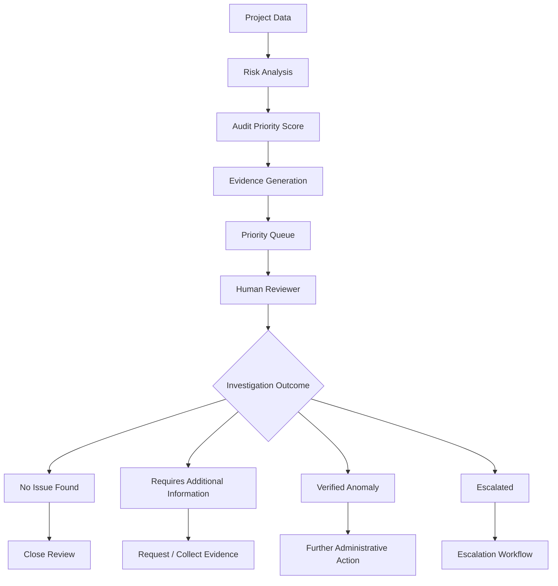

### Investigation outcomes

* **Under Review**
* **No Issue Found**
* **Requires Additional Information**
* **Verified Anomaly**
* **Escalated**

> **Verified anomaly is not automatically equivalent to fraud.**

The system assists human investigation; it does not replace authorized decision-makers.

---

# 🏗️ 13. System Architecture

MPLADS Sentinel follows a modular full-stack architecture.

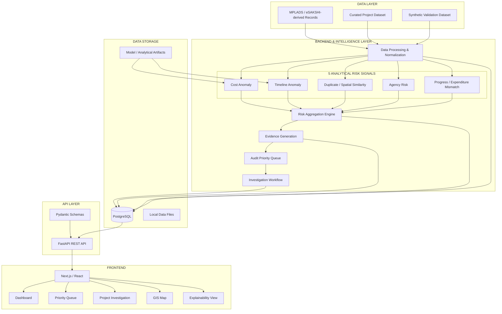

---

# 🔄 14. End-to-End Data Flow

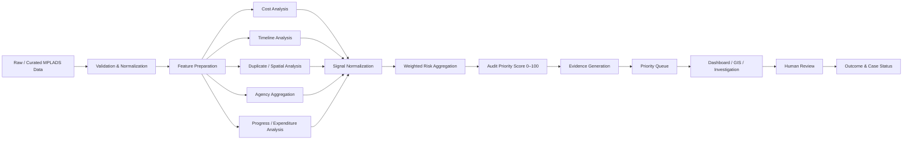

---

# 🧩 15. Layered Architecture

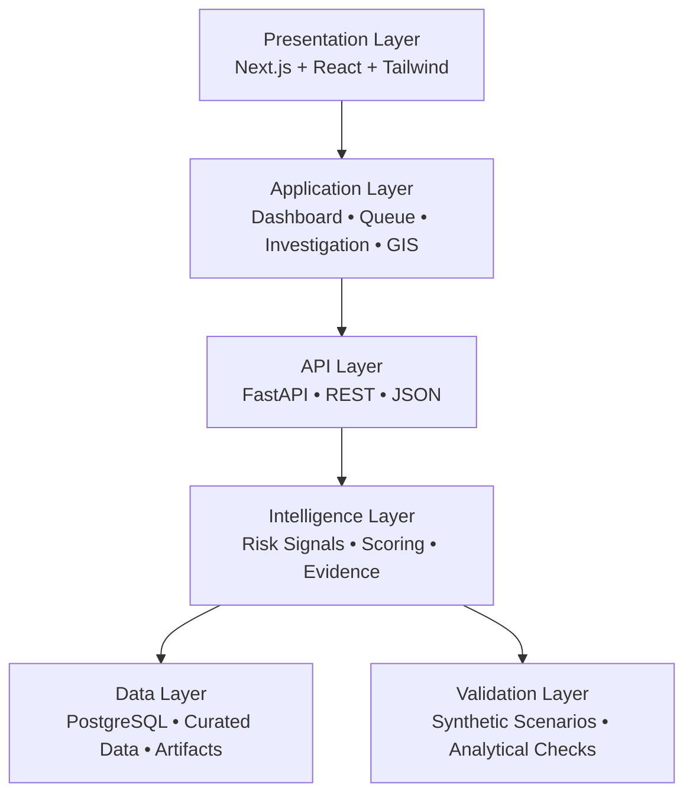

### Why this architecture?

The system separates:

* user experience
* application workflows
* API contracts
* analytical intelligence
* persistent data
* validation

This makes the platform easier to test, extend, and maintain.

---

# 🗺️ 16. GIS Intelligence Layer

The GIS component provides a spatial view of project activity.

The map can help users inspect:

* project distribution
* project status
* expenditure patterns
* high-priority projects
* geographic clusters
* potential spatial overlaps
* regional patterns

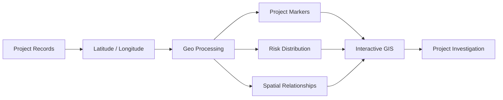

GIS is therefore not treated as decoration.

It connects spatial evidence with the project's risk and investigation workflow.

---

# 🔬 17. Validation Strategy

A responsible anomaly-detection system needs validation beyond a visually convincing dashboard.

Sentinel uses controlled synthetic scenarios to test whether analytical components respond to known abnormal patterns.

### Validation concept

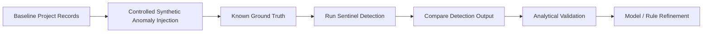

### Examples of controlled scenarios

* unusual project cost
* abnormal execution duration
* unusually similar projects
* agency-level unusual pattern
* expenditure/progress mismatch

> Synthetic records are explicitly treated as **validation/demo data** and are never represented as proof of real-world government irregularities.

---

# 🧪 18. Data Honesty

Sentinel follows a strict data-honesty principle.

### Data categories

| Data                                | Purpose                            |
| ----------------------------------- | ---------------------------------- |
| Curated MPLADS/eSAKSHI-derived data | Analytical/demo foundation         |
| Clearly labeled synthetic records   | Controlled validation              |
| Derived analytical features         | Risk computation                   |
| Model artifacts                     | Reproducible analytical processing |

### What Sentinel does NOT claim

* It is not an official Government of India system.
* It does not automatically establish fraud.
* Synthetic anomalies are not real government cases.
* MVP infrastructure is not presented as production government infrastructure.
* Model performance is not represented as real-world accuracy unless validated on appropriate labeled data.

---

# 🧠 19. Why Explainability Matters

Traditional black-box output:

```text
PROJECT #1847
RISK = 91
```

Sentinel's intended output:

```text
PROJECT #1847

AUDIT PRIORITY
91 / 100

Signals:
────────────────────────
Cost anomaly             26 / 30
Timeline anomaly         22 / 25
Spatial similarity       18 / 20
Agency risk               9 / 15
Progress mismatch         8 / 10

Evidence:
• Cost materially above peer benchmark
• Execution duration above comparable works
• Similar project identified nearby
• Financial progress exceeds physical progress

Status:
REQUIRES HUMAN REVIEW
```

This gives the reviewer a reason to investigate rather than merely an unexplained prediction.

---

# 🖥️ 20. Platform Experience

The intended investigation journey is:

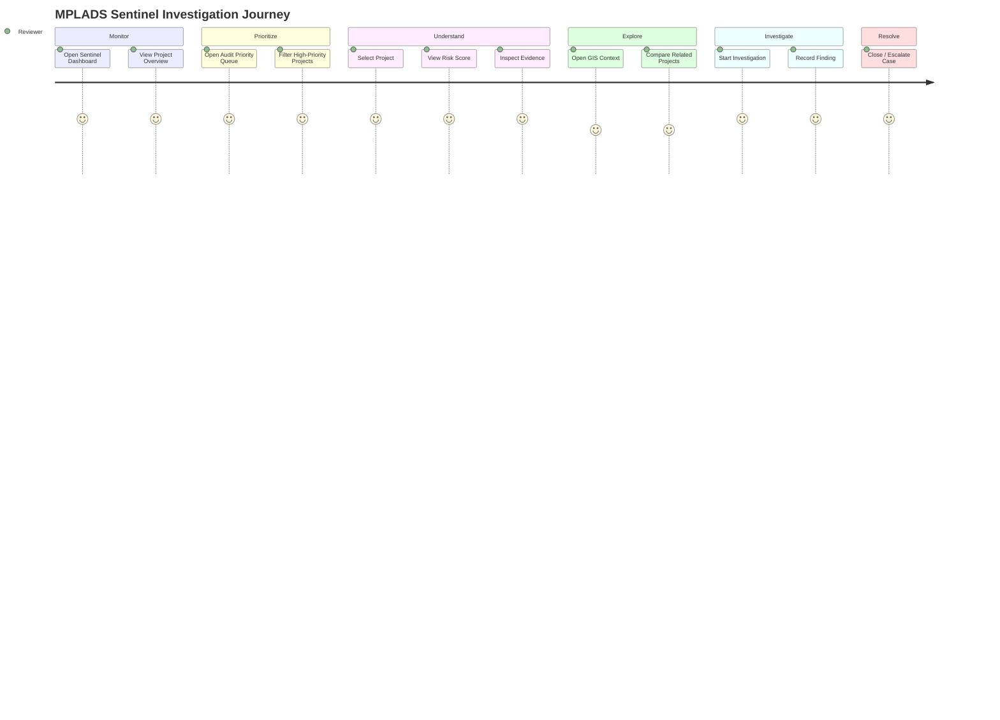

---

# 📊 21. Dashboard Architecture

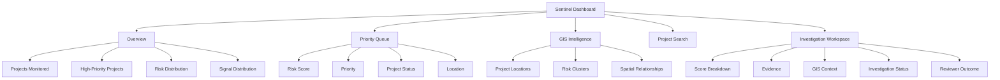

---

# 🛠️ 22. Technology Stack

## Frontend

* **Next.js**
* **React**
* **TypeScript / TSX**
* **Tailwind CSS**
* **Recharts**
* **Leaflet / React Leaflet**
* **Lucide React**
* React state management

## Backend

* **Python**
* **FastAPI**
* **Pandas**
* **scikit-learn**
* **joblib**
* Pydantic

## Database

* **PostgreSQL**
* SQLAlchemy

## Communication

```text
Frontend
   │
   │ REST / JSON
   ▼
FastAPI
   │
   ├── Analytical Services
   ├── Database Services
   └── Investigation Services
```

## Development

* Git
* GitHub
* VS Code
* Docker Compose
* Python 3.11
* Node.js

---

# 🗂️ 23. Repository Architecture

```text
mplads-sentinel/
│
├── frontend/
│   ├── app/
│   ├── components/
│   ├── lib/
│   ├── styles/
│   ├── public/
│   ├── package.json
│   └── tsconfig.json
│
├── backend/
│   ├── app/
│   │   ├── api/
│   │   ├── models/
│   │   ├── schemas/
│   │   ├── ml/
│   │   ├── data_pipeline/
│   │   ├── main.py
│   │   └── database.py
│   │
│   ├── model_artifacts/
│   ├── data/
│   └── requirements.txt
│
├── docs/
│   └── MASTER_ARCHITECTURE.md
│
├── docker-compose.yml
├── .env.example
├── .gitignore
└── README.md
```

> The repository structure may evolve during implementation as individual analytical modules and API contracts are finalized.

---

# 🔐 24. Security & Responsible Decision Support

Sentinel is designed around a principle of **decision support rather than automated enforcement**.

### Core principles

#### 1. Human authority remains final

The system prioritizes cases.

Authorized humans investigate and decide.

#### 2. Risk is not guilt

A high score represents analytical priority, not a legal or administrative conclusion.

#### 3. Evidence accompanies alerts

Whenever possible, signals should expose the underlying measurements responsible for the score.

#### 4. Data boundaries are explicit

Synthetic, curated, and derived data are clearly distinguished.

#### 5. Model limitations are acknowledged

No model is treated as universally correct.

---

# 🧱 25. MVP Architecture Philosophy

Sentinel intentionally avoids unnecessary infrastructure during the MVP stage.

### MVP

```text
Next.js
   ↓
FastAPI
   ↓
Python Analytics
   ↓
PostgreSQL
```

### Not required for the current MVP

* distributed microservice orchestration
* Kubernetes
* Kafka
* Celery
* Redis
* S3/MinIO
* mandatory PostGIS dependency
* large-scale cloud infrastructure

This keeps the prototype:

* easier to run
* easier to demonstrate
* easier to debug
* easier to validate
* easier to explain to judges

---

# 🚀 26. Scalability Path

The MVP is intentionally modular so components can evolve independently.

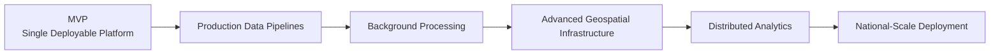

Potential future extensions can include:

* stronger semantic similarity models
* richer geospatial analytics
* additional anomaly signals
* automated evidence ingestion
* larger-scale asynchronous processing
* model monitoring
* analyst feedback loops
* production-grade object storage
* advanced role-based access control

These are **future directions**, not claims about the current MVP.

---

# 🎯 27. What Makes Sentinel Different?

Sentinel is not simply:

> “A dashboard with an AI score.”

Its architecture connects the entire reasoning chain:

```text
DATA
  ↓
ANALYSIS
  ↓
SIGNALS
  ↓
SCORE
  ↓
EVIDENCE
  ↓
PRIORITY
  ↓
INVESTIGATION
  ↓
HUMAN FINDING
```

The important design decision is that **every analytical signal is connected to an operational investigation workflow**.

That makes the system useful not only for detecting unusual patterns, but for answering:

> **“Why should this project be examined, and what evidence should the reviewer look at?”**

---

# 🏆 28. SIH-Focused Value Proposition

### Problem

Large-scale project monitoring makes it difficult to manually identify which works deserve immediate attention.

### Solution

MPLADS Sentinel applies multiple analytical signals to project data and converts them into an explainable audit-priority queue.

### Innovation

A unified pipeline connecting:

**Anomaly Detection + Benchmarking + Spatial Analysis + Explainability + GIS + Human Investigation**

### Impact

Instead of treating every project equally, authorities can focus investigative attention on projects with stronger evidence of unusual patterns.

### Responsible AI

The platform assists human reviewers rather than replacing them.

---

# 🧭 29. Complete System Blueprint

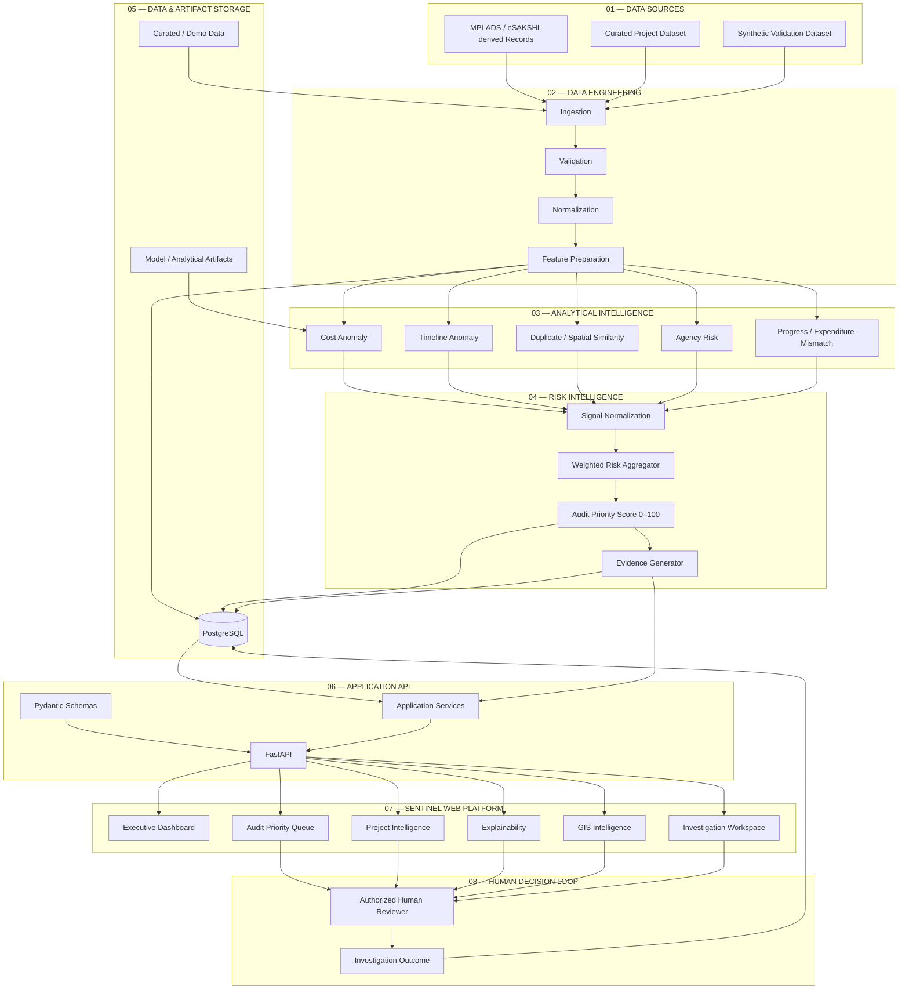

---

# 🔁 30. Sentinel's Reasoning Loop

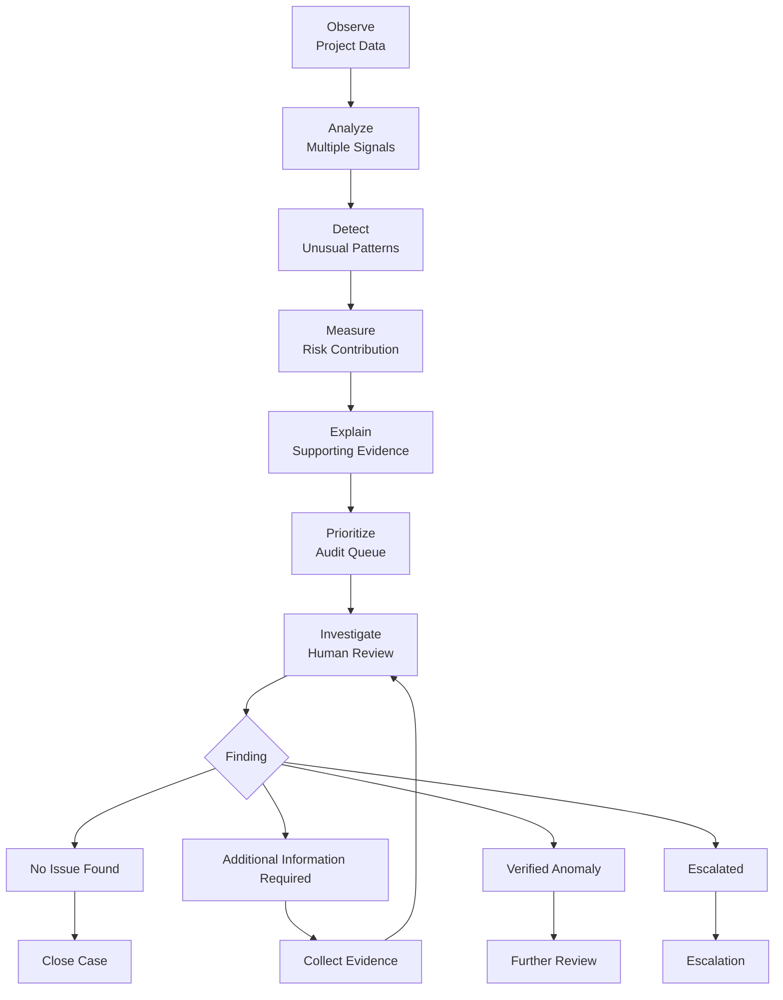

---

# 📋 31. Demonstration Flow

The recommended SIH demonstration follows one project from detection to investigation.

### Step 01 — Dashboard

Show the overall project monitoring view.

### Step 02 — Priority Queue

Show projects ordered by Audit Priority Score.

### Step 03 — Select a project

Open one high-priority project.

### Step 04 — Explain the score

Display:

* total score
* individual signal contributions
* supporting evidence

### Step 05 — GIS context

Show the project's geographic context and related spatial signals.

### Step 06 — Investigation

Open the investigation workspace.

### Step 07 — Human finding

Record the appropriate investigation outcome.

### The complete demo story

```text
"Sentinel found this project."
              ↓
"Here is its score."
              ↓
"Here is exactly why."
              ↓
"Here is the supporting evidence."
              ↓
"Here is its geographic context."
              ↓
"Now a human reviewer investigates."
```

---

# 👥 32. Team — Phantom Syndicate

MPLADS Sentinel is developed by **Team Phantom Syndicate** for Smart India Hackathon 2026.

| Team Member                | Responsibility                                                                                                                        |
| -------------------------- | ------------------------------------------------------------------------------------------------------------------------------------- |
| **Nidhi — Team Lead**      | Product direction, system coordination, architecture oversight, integration, technical decision-making and overall project leadership |
| **Arati A. Patil**         | Documentation, research support and presentation development                                                                          |
| **Agam BharatKumar Doshi** | Research, data analysis and domain/data support                                                                                       |
| **Iffa A. Attar**          | System architecture, domain design and solution structuring                                                                           |
| **Dayyanahmed Jamadar**    | Backend and machine-learning development                                                                                              |
| **Krupal Rayakar**         | Frontend development and UI/UX implementation                                                                                         |

### Team operating model

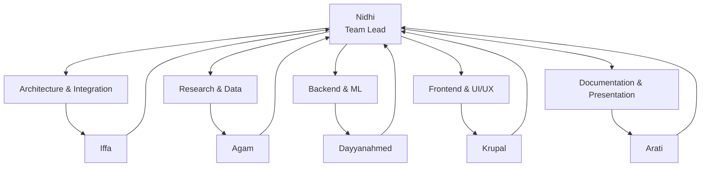

The architecture is designed so that each team member's contribution maps to a real part of the system rather than treating the project as one undifferentiated codebase.

---

# 🧩 33. Responsibility-to-System Mapping

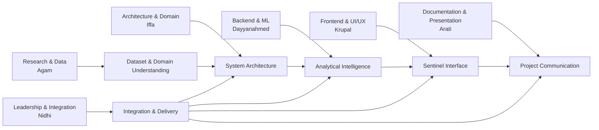

---

# 📈 34. Impact Model

Sentinel's intended impact can be represented as:

```text
                    MORE DATA
                       │
                       ▼
               Automated Screening
                       │
                       ▼
              Multi-Signal Analysis
                       │
                       ▼
             Evidence-Backed Ranking
                       │
                       ▼
              Focused Investigation
                       │
                       ▼
              Better Use of Review Time
                       │
                       ▼
             Stronger Monitoring & Audit
```

The objective is not to replace governance processes.

The objective is to help those processes **focus attention where analytical evidence indicates it may be most useful**.

---

# 🔮 35. Future Scope

Future versions can extend Sentinel with:

### Advanced Intelligence

* stronger semantic similarity models
* learned risk calibration from reviewer feedback
* additional anomaly-detection methods
* improved peer-group discovery

### Geospatial Intelligence

* richer spatial clustering
* advanced overlap analysis
* geographic trend detection
* deeper regional analytics

### Evidence Intelligence

* structured document analysis
* image verification
* geotag validation
* evidence-chain management

### Platform Scale

* asynchronous processing
* production-grade object storage
* distributed analytics
* model monitoring
* large-scale deployment

### Governance

* richer role-based access control
* investigation history
* audit trails
* reviewer feedback loops
* configurable institutional policies

> These capabilities represent the evolution path of the platform and are not claimed as part of the current MVP unless explicitly implemented.

---

# 📌 36. MVP Scope vs Future Scope

| Capability                     | Current MVP | Future |
| ------------------------------ | :---------: | :----: |
| Project analytics              |      ✅      |        |
| Cost anomaly                   |      ✅      |        |
| Timeline anomaly               |      ✅      |        |
| Duplicate/spatial signal       |      ✅      |        |
| Agency risk                    |      ✅      |        |
| Progress/expenditure mismatch  |      ✅      |        |
| Composite score                |      ✅      |        |
| Explainability                 |      ✅      |        |
| GIS visualization              |      ✅      |        |
| Human investigation workflow   |      ✅      |        |
| Synthetic validation           |      ✅      |        |
| Advanced semantic models       |             |   🔮   |
| Advanced document intelligence |             |   🔮   |
| Image verification             |             |   🔮   |
| Distributed processing         |             |   🔮   |
| Production-scale deployment    |             |   🔮   |

---

# ⚙️ 37. Running Locally

## Prerequisites

Recommended environment:

* Python 3.11
* Node.js
* npm
* PostgreSQL
* Git

> Python 3.11 is recommended for compatibility with the project's current machine-learning dependency set.

---

## Backend

From the repository root:

```powershell
cd mplads-sentinel

python -m venv .venv
.venv\Scripts\Activate.ps1

pip install -r backend\requirements.txt

python -m uvicorn backend.main:app --reload
```

The backend API will be available through the configured local FastAPI server.

---

## Frontend

Open another terminal:

```powershell
cd mplads-sentinel\frontend

npm install
npm run dev
```

Open the local development URL displayed by Next.js.

---

# 🧪 38. Development & Validation Philosophy

Every meaningful feature should follow:

```text
Implement
   ↓
Run
   ↓
Verify
   ↓
Inspect Diff
   ↓
Test
   ↓
Commit
   ↓
Push
```

This keeps the SIH codebase reproducible and prevents undocumented changes from accumulating.

---

# 🧾 39. Reproducibility

Sentinel aims to make the analytical workflow reproducible through:

* version-controlled source code
* explicit dependencies
* documented datasets
* deterministic validation scenarios where applicable
* stored analytical/model artifacts
* documented scoring methodology
* clear separation between real/curated and synthetic data

---

# 📚 40. Documentation

Recommended project documentation:

```text
docs/
│
├── MASTER_ARCHITECTURE.md
├── DATA_DICTIONARY.md
├── ML_METHODOLOGY.md
├── API_REFERENCE.md
├── VALIDATION.md
├── DEMO_RUNBOOK.md
└── DECISION_LOG.md
```

Each document should answer a different question:

| Document            | Question                                            |
| ------------------- | --------------------------------------------------- |
| MASTER_ARCHITECTURE | How does the whole system work?                     |
| DATA_DICTIONARY     | What does each field mean?                          |
| ML_METHODOLOGY      | How are signals calculated?                         |
| API_REFERENCE       | How does the frontend communicate with the backend? |
| VALIDATION          | How was the system tested?                          |
| DEMO_RUNBOOK        | How should the SIH demo be executed?                |
| DECISION_LOG        | Why were important architectural choices made?      |

---

# 🏁 41. Project Status

### Current stage

**SIH 2026 MVP Development**

The repository is being developed incrementally, with the architecture and analytical methodology designed around the SIH26102 problem statement.

The implementation prioritizes:

1. correctness
2. explainability
3. reproducibility
4. evidence-backed analysis
5. human decision support
6. focused MVP scope

---

# 🧠 42. The One-Line Architecture

If someone remembers only one thing about Sentinel:

```text
MPLADS DATA
    ↓
5 ANALYTICAL RISK SIGNALS
    ↓
AUDIT PRIORITY SCORE
    ↓
EXPLAINABLE EVIDENCE
    ↓
PRIORITY QUEUE
    ↓
GIS + INVESTIGATION
    ↓
HUMAN DECISION
```

---

# 🛡️ 43. The Sentinel Principle

> ### **AI detects patterns.**
>
> ### **Evidence explains them.**
>
> ### **Sentinel prioritizes them.**
>
> ### **Humans investigate them.**
>
> ### **Humans make the final decision.**

---

# 📜 44. License

Add the repository's chosen open-source license here once finalized.

---

# ⭐ 45. Final Project Statement

**MPLADS Sentinel is an explainable AI/ML- and GIS-powered audit-prioritization platform designed to help authorities identify which MPLADS projects may require closer attention.**

By combining multiple analytical signals into a transparent Audit Priority Score and linking that score to evidence, geographic context and a human investigation workflow, Sentinel transforms project monitoring from a purely record-by-record process into a **risk-informed investigation workflow**.

> **It does not replace the auditor.**
>
> **It helps the auditor know where to look first — and why.**

---

### Built for Smart India Hackathon 2026

**Problem Statement:** SIH26102
**Organization:** Ministry of Statistics and Programme Implementation (MoSPI)
**Division:** Data Informatics & Innovation Division (DIID)
**Category:** Software
**Team:** Phantom Syndicate
**Project:** MPLADS Sentinel
