# MPLADS Sentinel

## Explainable AI/ML and GIS-Based Risk Intelligence and Audit Prioritization for MPLADS

MPLADS Sentinel is an explainable analytical and AI/ML-assisted platform designed to analyze MPLADS project data, identify unusual patterns across financial, timeline, geographic, agency, and progress-related dimensions, and prioritize projects that may require closer human review.

The system combines five analytical risk signals into a transparent **Audit Priority Score from 0–100**, generates evidence explaining the factors contributing to the score, and presents prioritized projects through a monitoring, GIS, and investigation interface.

> **Sentinel identifies patterns that deserve attention. It does not automatically declare fraud or irregularity. Final findings remain with authorized human reviewers.**

---

## Smart India Hackathon 2026

| Field             | Details                                                     |
| ----------------- | ----------------------------------------------------------- |
| Hackathon         | Smart India Hackathon 2026                                  |
| Problem Statement | SIH26102                                                    |
| Organization      | Ministry of Statistics and Programme Implementation (MoSPI) |
| Division          | Data Informatics & Innovation Division (DIID)               |
| Category          | Software                                                    |
| Theme             | Smart Automation                                            |
| Project           | MPLADS Sentinel                                             |
| Team              | Phantom Syndicate                                           |

---

## Problem

Large-scale implementation of MPLADS projects produces records containing information such as project expenditure, execution timelines, locations, implementing agencies, project descriptions, and reported progress.

When a large number of project records must be monitored, examining every project with the same level of attention can make prioritization difficult.

Potentially unusual patterns may appear across multiple dimensions:

* unusual project costs
* unusual execution durations
* potentially similar or spatially related projects
* repeated agency-level patterns
* differences between expenditure and reported physical progress

These signals become more useful when considered together rather than independently.

MPLADS Sentinel addresses this by combining multiple analytical signals into an explainable prioritization workflow that helps reviewers determine **which projects may warrant closer examination first**.

---

## Proposed Solution

Sentinel converts project data into an evidence-backed investigation workflow.

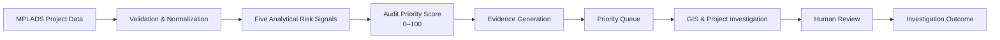

The workflow is:

* analyze project data
* detect unusual patterns
* calculate analytical risk signals
* combine signals into a transparent priority score
* generate supporting evidence
* prioritize projects for review
* provide geographic and project context
* support human investigation and outcome recording

---

## Core Analytical Signals

Sentinel uses five complementary analytical signals.

| Signal                          | Maximum Contribution | Purpose                                                                           |
| ------------------------------- | -------------------: | --------------------------------------------------------------------------------- |
| Cost Anomaly                    |                   30 | Identify unusual project cost patterns relative to relevant comparison groups     |
| Timeline Anomaly                |                   25 | Identify unusual execution-duration patterns                                      |
| Duplicate / Spatial Similarity  |                   20 | Identify potentially related projects using geographic and descriptive similarity |
| Agency Risk                     |                   15 | Identify unusual historical patterns associated with implementing agencies        |
| Progress / Expenditure Mismatch |                   10 | Identify unusual relationships between expenditure and reported progress          |
| **Total**                       |              **100** | **Audit Priority Score**                                                          |

These are referred to as **analytical risk signals** rather than five independent AI models because Sentinel combines multiple approaches, including machine learning, statistical analysis, rule-based calculations, aggregation, geographic analysis, and similarity analysis.

---

## Audit Priority Score

Each analytical signal contributes a bounded value to the final score.

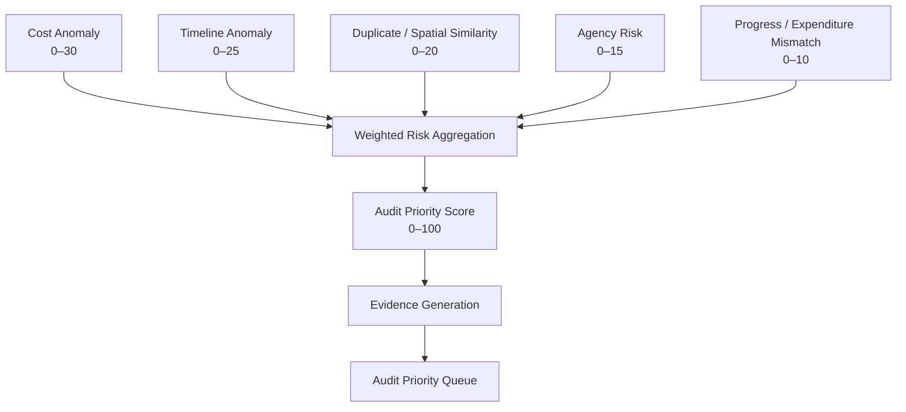

Conceptually:

```text
Audit Priority Score
=
Cost Contribution
+ Timeline Contribution
+ Spatial / Similarity Contribution
+ Agency Contribution
+ Progress Contribution
```

Maximum contributions:

```text
Cost Anomaly                    ≤ 30
Timeline Anomaly                ≤ 25
Duplicate / Spatial Similarity ≤ 20
Agency Risk                    ≤ 15
Progress Mismatch              ≤ 10
-----------------------------------
Total                           ≤ 100
```

The score represents **analytical priority**, not the probability that fraud or wrongdoing has occurred.

### MVP Weighting

| Signal                          | Weight |
| ------------------------------- | -----: |
| Cost Anomaly                    |    30% |
| Timeline Anomaly                |    25% |
| Duplicate / Spatial Similarity  |    20% |
| Agency Risk                     |    15% |
| Progress / Expenditure Mismatch |    10% |

These are initial MVP weights selected to provide a transparent and controllable scoring mechanism. They are not presented as universally optimal weights.

---

## Cost Anomaly

### Objective

Identify projects whose cost is unusual relative to an appropriate comparison group.

Depending on the available data and implementation stage, the analysis can use:

* peer-project benchmarking
* percentile comparison
* statistical deviation
* Isolation Forest where appropriate

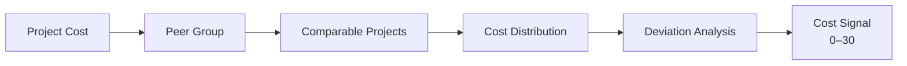

Example evidence:

```text
Observed Cost: ₹X
Peer Median: ₹Y
Deviation: +34%

Cost Signal: Elevated
Contribution: 22 / 30
```

The exact values depend on the dataset and comparison methodology.

---

## Timeline Anomaly

### Objective

Identify projects whose execution duration differs substantially from relevant peer or benchmark patterns.

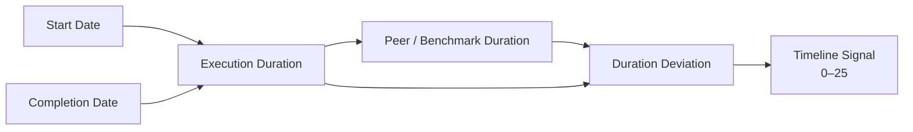

The system focuses on **unusual duration patterns**.

A duration anomaly should not automatically be interpreted as a delay unless the available data contains an appropriate planned or expected completion reference.

---

## Duplicate and Spatial Similarity

Projects can be analyzed for potentially related records using a combination of:

* geographic distance
* project description similarity
* project attributes
* relevant contextual information

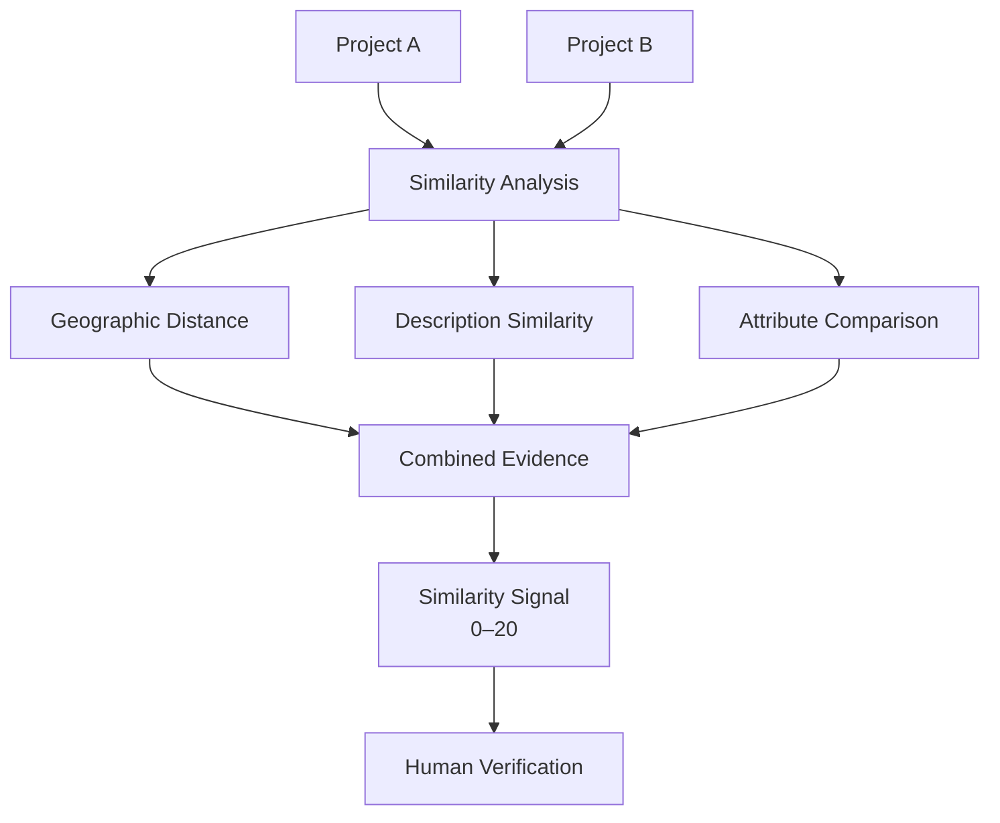

A similarity signal identifies a **candidate relationship for investigation**. It does not establish that two projects are duplicates.

---

## Agency Risk

Project-level analysis can be supplemented by historical aggregation at the implementing-agency level.

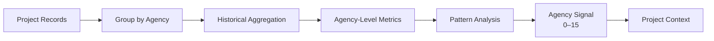

Agency-level information provides additional context when reviewing individual projects.

The purpose is to identify patterns that may warrant examination, not to automatically characterize an agency as problematic.

---

## Progress and Expenditure Mismatch

Sentinel can compare reported financial expenditure with reported physical progress to identify potentially unusual relationships.

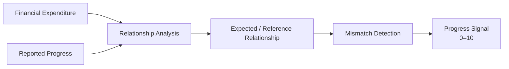

For example, a project with substantially higher reported expenditure relative to its reported progress may receive a review signal.

This signal alone does not establish wrongdoing.

---

## Explainability

A numerical score without supporting evidence is difficult to investigate.

Sentinel therefore connects analytical signals to the evidence that produced them.

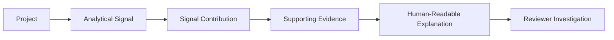

Instead of showing only:

```text
Audit Priority Score: 87 / 100
```

the system is designed to provide a breakdown such as:

```text
Audit Priority Score: 87 / 100

Cost Anomaly:                    26 / 30
Timeline Anomaly:                22 / 25
Duplicate / Spatial Similarity:  18 / 20
Agency Risk:                      9 / 15
Progress Mismatch:                8 / 10
```

The reviewer can then inspect the evidence associated with individual signals.

Possible evidence includes:

* observed project value
* peer benchmark
* deviation from benchmark
* execution duration
* geographic distance
* similarity indicators
* agency-level aggregates
* expenditure/progress relationship

---

## Human-in-the-Loop Investigation

Sentinel intentionally separates **automated analytical prioritization** from **human decision-making**.

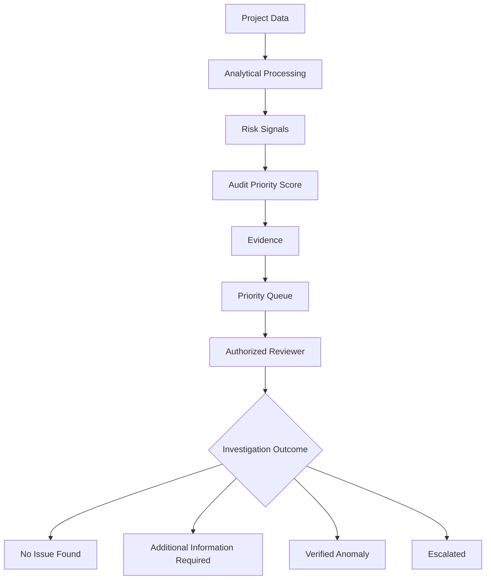

Possible investigation outcomes include:

* **No Issue Found**
* **Additional Information Required**
* **Verified Anomaly**
* **Escalated**

A **Verified Anomaly** is an investigation outcome and should not automatically be interpreted as proof of fraud.

---

## GIS Intelligence

The GIS component adds geographic context to project analysis.

It can support visualization of:

* project distribution
* project status
* expenditure patterns
* high-priority projects
* geographic clusters
* potentially related projects
* spatial relationships

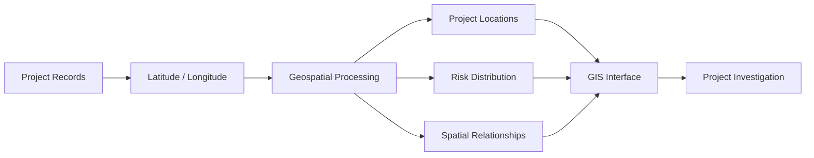

GIS is therefore part of the investigation workflow rather than only a map visualization.

---

## System Architecture

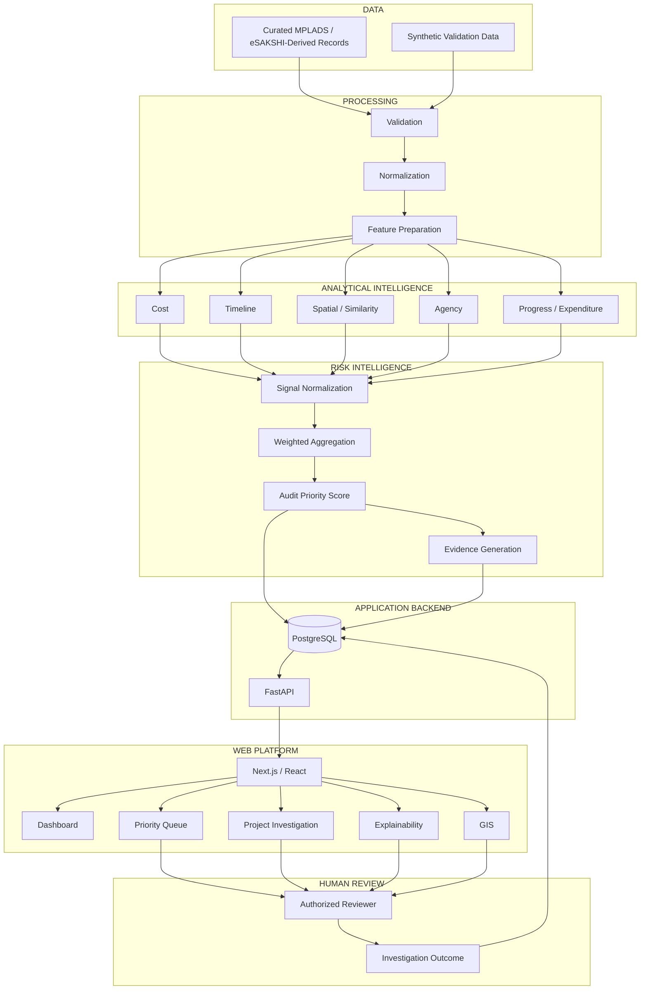

---

## Technology Stack

### Frontend

* Next.js
* React
* TypeScript / TSX
* Tailwind CSS
* Recharts
* Leaflet / React Leaflet
* Lucide React

### Backend

* Python
* FastAPI
* Pandas
* scikit-learn
* joblib
* Pydantic

### Database

* PostgreSQL
* SQLAlchemy

### Communication

The frontend communicates with the backend through REST/JSON APIs.

```mermaid
flowchart LR
    A["Next.js / React"]
    -->|"REST / JSON"|
    B["FastAPI"]

    B --> C["Application Services"]
    C --> D[("PostgreSQL")]
    C --> E["Analytical Components"]
```

---

## Data Sources and Data Honesty

Sentinel distinguishes between different classes of data used during development and demonstration.

### Curated / Derived Project Data

Project records prepared for analytical processing and demonstration.

### Synthetic Validation Data

Controlled data or injected scenarios used to test whether analytical components respond to known patterns.

### Analytical Features

Derived values calculated from project records for use by the analytical signals.

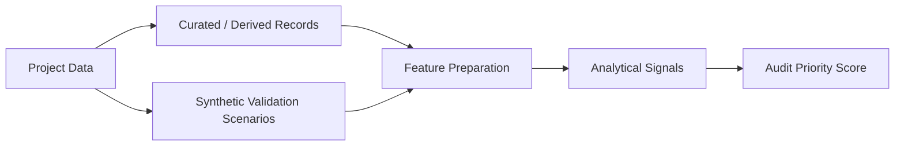

Synthetic anomalies are explicitly treated as **synthetic validation scenarios** and are not presented as actual government findings.

Similarly, a high Audit Priority Score is not represented as proof of fraud or irregularity.

---

## Validation Strategy

Sentinel uses controlled scenarios to evaluate whether the analytical pipeline responds to known patterns.

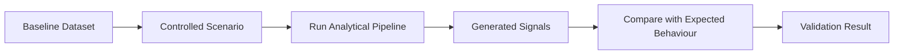

Example validation scenarios include:

* unusual project cost
* unusual execution duration
* potentially similar projects
* agency-level patterns
* expenditure/progress mismatch

The validation process is intended to test **analytical behaviour**, not to claim that synthetic scenarios represent real-world findings.

---

## Repository Structure

```text
mplads-sentinel/
│
├── frontend/
│   ├── app/
│   ├── components/
│   ├── lib/
│   ├── styles/
│   ├── public/
│   ├── package.json
│   └── tsconfig.json
│
├── backend/
│   ├── app/
│   │   ├── api/
│   │   ├── models/
│   │   ├── schemas/
│   │   ├── ml/
│   │   ├── data_pipeline/
│   │   ├── main.py
│   │   └── database.py
│   │
│   ├── model_artifacts/
│   ├── data/
│   └── requirements.txt
│
├── docs/
│   └── MASTER_ARCHITECTURE.md
│
├── docker-compose.yml
├── .env.example
├── .gitignore
└── README.md
```

---

## Data Model

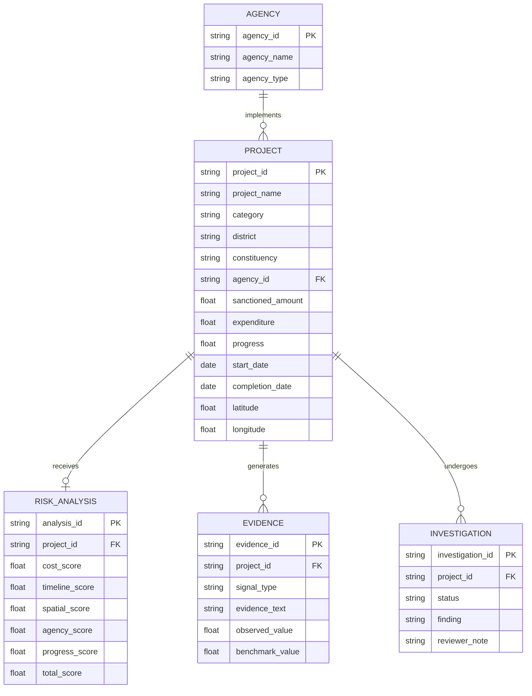

---

## Dashboard

The web platform is organized around the investigation workflow.

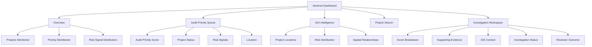

Primary user journey:

**Dashboard → Priority Queue → Project → Evidence → GIS Context → Investigation → Outcome**

---

## Local Development

### Prerequisites

Recommended development environment:

* Python 3.11
* Node.js
* npm
* PostgreSQL
* Git

Python 3.11 is recommended for compatibility with the project's machine-learning dependencies.

### Frontend

Run the frontend from the `frontend` directory:

```powershell
cd frontend
npm install
npm run dev
```

### Backend

From the repository root, create a Python virtual environment:

```powershell
python -m venv .venv
```

Activate it on Windows PowerShell:

```powershell
.venv\Scripts\Activate.ps1
```

Install backend dependencies:

```powershell
pip install -r backend\requirements.txt
```

Start the FastAPI application:

```powershell
uvicorn backend.app.main:app --reload
```

The backend will typically be available at:

```text
http://localhost:8000
```

The frontend development server will typically be available at:

```text
http://localhost:3000
```

If PostgreSQL is required by the current application configuration, create the required database and configure the connection through `.env`.

### Environment Variables

Create a local environment file from the provided template:

```powershell
Copy-Item .env.example .env
```

Configure the required database and application values in `.env`.

Do not commit `.env`, passwords, API keys, or other credentials.

---

## MVP Architecture Philosophy

The MVP intentionally keeps the core architecture lightweight.

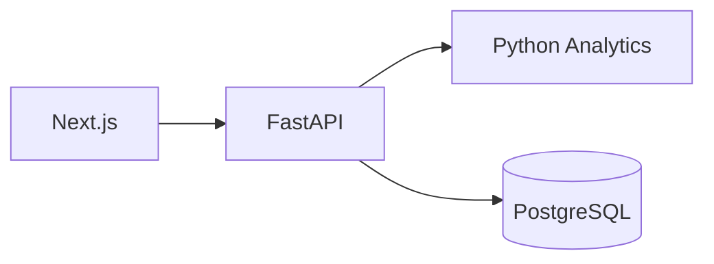

The architecture is designed to remain:

* understandable
* reproducible
* testable
* easy to demonstrate
* easy to debug
* modular enough to extend

Distributed infrastructure is not a prerequisite for the core MVP.

Technologies such as Kafka, Kubernetes, Celery, Redis, object storage, or mandatory PostGIS infrastructure can be considered later if scale and deployment requirements justify them.

---

## Project Scope

### Current MVP Focus

The MVP focuses on:

* project data processing
* five analytical risk signals
* transparent 0–100 prioritization
* evidence generation
* priority-based project review
* GIS context
* human-in-the-loop investigation
* controlled validation scenarios
* modular frontend/backend architecture

### Outside the Core MVP

The system does not attempt to:

* automatically declare fraud
* conduct fully autonomous investigations
* guarantee detection of every irregularity
* replace authorized human reviewers
* require large-scale distributed infrastructure for the core demonstration

---

## Limitations

### Data Quality

Analytical output depends on the completeness, accuracy, and consistency of the underlying project data.

### Threshold Sensitivity

Different datasets and peer-group definitions can produce different anomaly results.

### Weight Selection

The current scoring weights are MVP design choices and should be validated and calibrated using appropriate domain evidence and historical evaluation.

### Similarity Interpretation

Geographic or descriptive similarity can identify candidate relationships but cannot establish duplication on its own.

### Agency-Level Patterns

Historical aggregation can provide useful context but should not be interpreted as proof that an agency has acted improperly.

### Human Verification

Final conclusions require examination of supporting records and appropriate human review.

---

## Future Scope

Potential extensions include:

* richer semantic similarity models
* advanced geospatial analysis
* additional analytical signals
* document and evidence intelligence
* historical trend analysis
* reviewer feedback loops
* analytical model monitoring
* asynchronous processing
* production-grade data pipelines
* advanced access control
* larger-scale deployment infrastructure

These are future directions and are not presented as current MVP capabilities.

---

## SIH Demonstration Flow

A strong demonstration follows a single project through the complete Sentinel workflow.

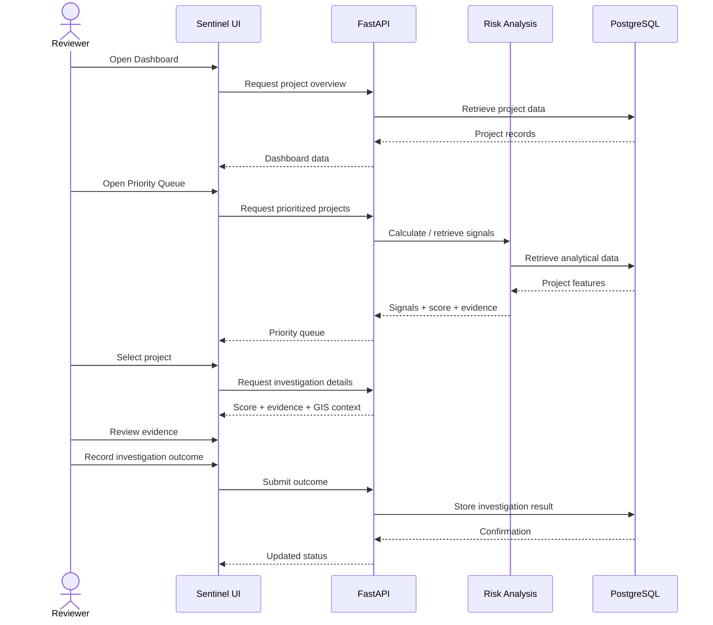

The demonstration story is:

```text
Project Data
     ↓
Five Analytical Signals
     ↓
Audit Priority Score
     ↓
Evidence
     ↓
Priority Queue
     ↓
GIS + Project Investigation
     ↓
Human Review
     ↓
Investigation Outcome
```

---

## Responsible AI and Design Principles

### Explainability

Important analytical results should be connected to measurable evidence wherever possible.

### Human Decision-Making

The system prioritizes projects for attention; it does not replace authorized human review.

### Data Honesty

Curated, derived, and synthetic data are clearly distinguished.

### Reproducibility

Analytical methods, dependencies, datasets, and validation scenarios should be documented.

### Modular Architecture

Data processing, analytics, backend services, and frontend presentation are separated so that components can evolve independently.

### MVP Discipline

The project prioritizes a coherent, explainable working system instead of unnecessary infrastructure or unsupported capabilities.

---

## Team — Phantom Syndicate

MPLADS Sentinel is being developed by **Team Phantom Syndicate** for Smart India Hackathon 2026.

| Team Member                | Primary Responsibility                                                                                                        |
| -------------------------- | ----------------------------------------------------------------------------------------------------------------------------- |
| **Nidhi — Team Lead**      | Product direction, system coordination, architecture oversight, integration, technical decision-making and project leadership |
| **Arati A. Patil**         | Documentation, research support and presentation development                                                                  |
| **Agam BharatKumar Doshi** | Research, data analysis and domain/data support                                                                               |
| **Iffa A. Attar**          | System architecture, domain design and solution structuring                                                                   |
| **Dayyanahmed Jamadar**    | Backend and machine-learning development                                                                                      |
| **Krupal Rayakar**         | Frontend development and UI/UX implementation                                                                                 |

---

## Project Status

**Smart India Hackathon 2026 — MVP Development**

MPLADS Sentinel is being developed around **SIH Problem Statement SIH26102**.

The implementation is focused on:

* analytical correctness
* explainability
* evidence-backed prioritization
* reproducibility
* human-in-the-loop investigation
* modular architecture
* focused MVP scope

Features and technologies are documented according to their actual implementation status rather than being presented as completed capabilities prematurely.
